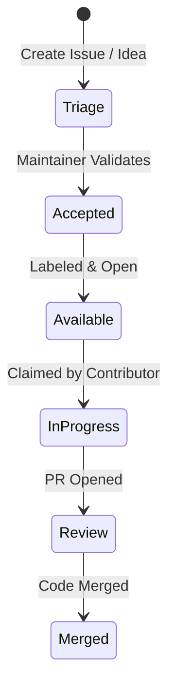

# Contributing to Luminary 🌟

First off, thank you for considering contributing to Luminary! It is people like you who make Luminary a premium, local-first learning cockpit.

By participating in this project, you agree to abide by our **Code of Conduct** (see [SECURITY.md](SECURITY.md)).

---

## 🗺️ Contribution Paths

We welcome all kinds of contributions! Whether you write code, refine search evals, polish CSS, or edit documentation, there is a place for you:

| Role | Focus Areas | Key Technologies |
| :--- | :--- | :--- |
| **Backend Engineer** | Ingestion pipeline, LiteLLM integrations, vector database search, API design | Python 3.13, FastAPI, SQLAlchemy, LanceDB, Kuzu |
| **Frontend Engineer** | User interface, state management, PDF rendering, graph visualizations | React 18, TypeScript 5, Tailwind CSS, Zustand, Sigma.js |
| **Search & AI Quality** | Retrieval accuracy (HR@5/MRR/nDCG), faithfulness evaluation, golden datasets | Evals harness (`evals/`), NLI faithfulness (HHEM) |
| **Technical Writer** | Setup guides, architecture descriptions, inline documentation | Markdown |

---

## 🚀 Quickstart Local Setup

Before getting started, make sure you have:
1. **Python 3.13** installed (with `uv` package manager recommended).
2. **Node.js** (v20+) and `npm`.
3. **Ollama** running locally (if testing local LLM features).

### Development Workflow

1. **Fork and Clone the Repo**:
   ```bash
   git clone https://github.com/YOUR-USERNAME/luminary.git
   cd luminary
   ```
2. **Install Dependencies**:
   ```bash
   make install
   ```
   *This sets up both frontend and backend virtual environments and downloads base models.*
3. **Run Dev Servers**:
   ```bash
   make dev
   ```
   *Starts the FastAPI backend on port `7820` (hot-reloaded) and the Vite frontend on port `5173`.*

### Useful Commands

| Command | Action |
| :--- | :--- |
| `make dev` | Start backend & frontend dev servers concurrently |
| `make ci` | Run full CI checks (linters, typecheck, unit tests, build) |
| `make test` | Run pytest suite |
| `make lint` | Run `ruff` check and frontend typecheck (`tsc`) |
| `make stop` | Stop all Luminary processes on ports `7820` and `5173` |

---

## 📐 Architecture & Key Concepts

To keep our codebase clean and maintainable, we enforce a set of strict architectural boundaries. Please review these files before writing code:

1. **Dependency Inversion**: Read [architecture.md](docs/architecture.md) to understand our **6-layer dependency rule**:
   `Types -> Config -> Repo -> Service -> Runtime -> API` (no reverse/upward imports).
2. **Invariants**: Read [invariants.md](docs/invariants.md) to understand critical safety contracts, such as column positions and database initializers.
3. **Redesign Spec**: Read [notes-redesign-spec.md](docs/notes-redesign-spec.md) for notes editing patterns.

---

## 🛠️ Database Schema Changes & Alembic

`backend/app/models.py` is the source of truth for the relational metadata database. Schema changes are versioned using Alembic.

1. **Edit Models**: Make changes in `backend/app/models.py`.
2. **Generate Migration**: Run `make db-revision m="add table foo"`.
   > [!WARNING]
   > Always run `make db-revision` rather than raw `alembic revision`. The Makefile target builds a clean throwaway database from the migrations and diffs against that, avoiding spurious drop statements for local virtual tables.
3. **Review Migration**: Open the generated file in `backend/alembic/versions/` and inspect the DDL. Ensure it doesn't contain destructive `drop_table`/`drop_column` commands due to misread schema differences.
4. **Apply Migration**: Run `make db-migrate`.

### ⚠️ FTS5 SQLite Virtual Tables Invariant
The five FTS5 virtual tables are defined in raw SQL in `db_init.py`. Alembic is configured to ignore them via `alembic_include_name`. 
*   **Column Order is a Contract**: SQLite references shadow-table columns positionally (e.g., `c0`, `c1`, `c2`). If you reorder columns in `db_init.py`, SQLite queries will return incorrect columns instead of raising errors. See invariant **I-4** in [invariants.md](docs/invariants.md).

---

## 📋 The Triage & Contribution Process



### 1. Reporting a Bug or Requesting a Feature
Found something broken, or have an idea? **[Open an issue](https://github.com/nupsea/luminary/issues/new/choose)** from the repository's **Issues** tab. Pick a template:
*   **🐛 Bug Report** — something crashed or behaved wrong. Include steps to reproduce, your OS, and the model/mode you were running.
*   **💡 Feature Request** — an enhancement or new capability, and the learning problem it solves.

Search [existing issues](https://github.com/nupsea/luminary/issues) first to avoid duplicates. For setup troubleshooting or general questions, use [Discussions](https://github.com/nupsea/luminary/discussions) rather than an issue.

### 2. Finding an Issue to Work On
We use custom labels to classify tasks. Look for:
*   `difficulty/good-first-issue` — highly scoped, localized, ideal for your first PR.
*   `difficulty/medium` — requires a basic understanding of backend/frontend services.
*   `area/frontend` or `area/backend` — to filter by stack.
*   You can also check our [.github/SUGGESTED_ISSUES.md](.github/SUGGESTED_ISSUES.md) list for immediate ideas!

### 3. Claiming an Issue
*   To avoid duplicate work, please claim an issue before starting. Comment `.take` or `/assign` on the issue.
*   A maintainer (or bot) will assign it to you.
*   **Note**: To keep the issue tracker active, if there are no linked PRs or status updates within **7 days**, the issue will be unassigned and returned to `status/available`.

### 4. Pull Request Guidelines
*   Create a branch from `master` using a descriptive name (e.g., `feat/dark-mode-pdf` or `fix/ollama-timeout`).
*   Follow the **6-layer import rule** (no reverse imports) — see [architecture.md](docs/architecture.md).
*   Route **all LLM calls through LiteLLM**; never call a provider SDK directly.
*   New API endpoints require **at least one pytest test**.
*   Ensure that `make ci` passes locally before requesting a review.
*   Fill out the template in [.github/PULL_REQUEST_TEMPLATE.md](.github/PULL_REQUEST_TEMPLATE.md).
*   Link the issue your PR resolves (e.g., `Closes #123`).
