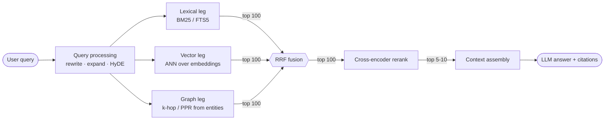
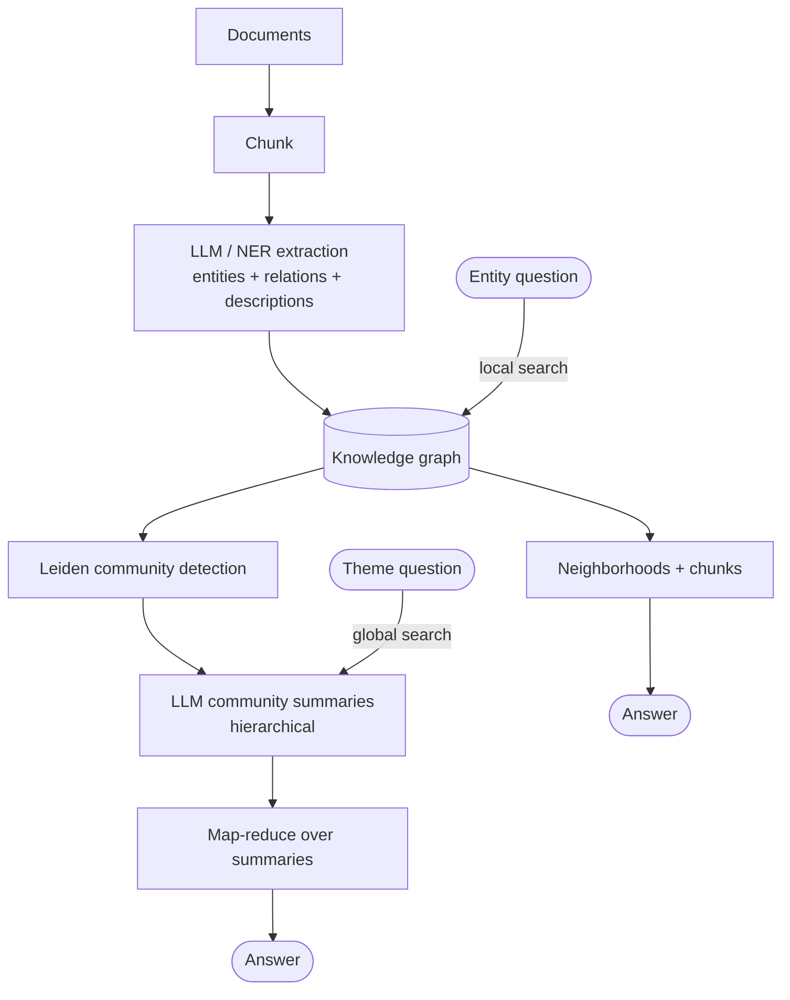

# Retrieval & Context Memory: A Practical Deep-Dive

*From inverted indexes to agent memory — lexical, vector, and graph search; fusion; reranking; phased ranking; and memory architectures for LLM systems.*

---

## Part 0 — The Retrieval Problem

Retrieval is the task of finding, from a large corpus of documents, the small subset most relevant to a query. Every retrieval system, from a 1970s library catalog to a modern RAG pipeline, is solving the same optimization:

> **Maximize relevance, subject to a latency and cost budget.**

Three tensions shape every design decision you'll make:

1. **Recall vs. Precision.** Recall asks "did I find *all* the relevant items?" Precision asks "is everything I returned *actually* relevant?" Cheap, broad methods maximize recall; expensive, careful methods maximize precision. Real systems chain them (see Phased Ranking, Part 6).
2. **Exactness vs. Meaning.** Lexical search matches *tokens* ("heart attack" ≠ "myocardial infarction"). Vector search matches *meaning* but can miss exact identifiers ("error code 0x80070057"). Neither wins alone — hence hybrid search.
3. **Latency vs. Quality.** A cross-encoder scoring every document in a 10M-doc corpus would be near-perfect and take hours. An inverted index answers in milliseconds. The art is spending compute only where it matters.

**A running analogy: the library.** Picture a huge public library. The card catalog, organized by exact title and subject words, is *lexical search*. A well-read librarian who understands what you *mean* and walks you to the right shelf is *vector search*. The web of cross-references between books — "readers of this also cite…" — is *graph search*. Asking two librarians independently and trusting the books they *both* suggest is *fusion*. Skimming the shortlisted books' actual pages before handing you the best three is *reranking*. And the librarian remembering that you're the person who asked about Byzantine history last month is *memory*. We'll return to this library throughout.

**A running case study: Luminary.** [Luminary](https://github.com/nupsea/luminary) is a local-first study app — upload a book or paper, ask questions with citations, review FSRS-scheduled flashcards — and it happens to be a textbook implementation of nearly everything in this tutorial: SQLite **FTS5** for the BM25 leg, **LanceDB** with locally-run bge-m3 embeddings for the vector leg, a **Kuzu** knowledge graph (entities extracted by GLiNER) for the graph leg, **RRF** fusing all three, **LangGraph** for workflow orchestration, and a **RAGAS eval harness** with HR@5 / MRR / Faithfulness thresholds. "In Luminary" notes below map each concept onto that concrete stack, alongside analogies from products you already use.

**Core vocabulary**

| Term | Meaning |
|---|---|
| Corpus | The full collection of documents/chunks |
| Query | The user's information need, as text |
| Relevance | How well a document satisfies the query (graded or binary) |
| Index | A precomputed data structure that makes search fast |
| Recall@k | Fraction of relevant docs appearing in the top-k results |
| MRR | Mean Reciprocal Rank — 1/rank of the first relevant result, averaged |
| NDCG | Normalized Discounted Cumulative Gain — rewards relevant docs ranked higher, with graded relevance |

---

## Part 1 — Lexical Search

Lexical (sparse, keyword) search matches the literal tokens of the query against tokens in documents. It has been the backbone of search for 50 years and remains unreasonably effective.

### 1.1 The Inverted Index

The core data structure. Instead of storing `document → words`, store `word → documents`:

```
"neural"   → [doc3, doc17, doc42]
"network"  → [doc3, doc9, doc17]
"protocol" → [doc9, doc51]
```

Each entry (a **posting list**) also stores term frequency and positions. Query "neural network" becomes: fetch both posting lists, intersect/union them, score the candidates. This is why lexical search is O(query terms), not O(corpus size) — and why it scales to billions of documents.

> **Analogy:** an inverted index is the *index at the back of a textbook*. To find where photosynthesis is discussed, you don't read all 900 pages (a full scan); you flip to the index — "photosynthesis → pp. 88, 214, 302" — and jump straight there. The publisher paid the indexing cost once; every reader benefits forever. That's the offline-index / online-lookup bargain every search engine makes.

**The text pipeline** that feeds the index matters as much as the index:

- **Tokenization** — split text into terms ("don't" → `don`, `t`? or `don't`?)
- **Normalization** — lowercase, strip accents/diacritics
- **Stemming/Lemmatization** — "running", "ran" → "run" (stemmers like Porter are crude but fast; lemmatizers use dictionaries)
- **Stop words** — dropping "the", "of", "a" (modern systems often keep them; BM25 down-weights them naturally)

A mismatch between how you index and how you tokenize queries is the #1 cause of "why doesn't my search find this?" bugs.

### 1.2 TF-IDF: the intuition BM25 refines

Two signals define classical relevance:

- **Term Frequency (TF):** a doc mentioning "python" 10 times is more about Python than one mentioning it once.
- **Inverse Document Frequency (IDF):** "python" appearing in 100 of 1M docs is highly discriminative; "the" appearing in all of them carries no signal.

TF-IDF score = TF × IDF. Simple, but flawed: TF grows linearly (a doc saying "python" 100 times isn't 10× more relevant than one saying it 10 times) and long documents get unfair advantages.

### 1.3 BM25 — the workhorse

**Best Matching 25** (from the Okapi system, 1990s) fixes both flaws and is still the default in Elasticsearch, OpenSearch, Lucene, Vespa, and SQLite FTS5.

For query Q with terms q₁…qₙ and document D:

```
score(D, Q) = Σᵢ IDF(qᵢ) · ( f(qᵢ, D) · (k1 + 1) ) / ( f(qᵢ, D) + k1 · (1 − b + b · |D| / avgdl) )

IDF(qᵢ) = ln( (N − n(qᵢ) + 0.5) / (n(qᵢ) + 0.5) + 1 )
```

Where `f(qᵢ, D)` is term frequency in D, `|D|` is doc length, `avgdl` is average doc length, `N` is corpus size, `n(qᵢ)` is how many docs contain the term.

**The two knobs:**

- **k1 (≈1.2–2.0, default 1.2):** controls **term-frequency saturation**. As TF grows, the score asymptotically approaches k1+1 — the 50th occurrence of a word adds almost nothing. k1=0 makes it binary (present/absent); higher k1 lets repeated terms keep mattering.
- **b (0–1, default 0.75):** controls **length normalization**. b=1 fully penalizes long documents; b=0 ignores length. Tune down (~0.3) for corpora where long docs are legitimately richer (books), keep high for corpora padded with boilerplate.

> **Analogies for the knobs.** *k1 (saturation)* is **salt in soup**: the first pinch transforms the dish, the tenth barely registers, the fiftieth does nothing. A document mentioning "python" 50 times is about Python — but not 50× more than one mentioning it 5 times. *b (length normalization)* is **grading essays fairly**: four keyword mentions in a 1-page note mean more than four mentions buried in a 10-page essay, so scores are read relative to length — but only partially (b=0.75), because long documents sometimes genuinely cover more.

**A tiny worked example.** Corpus: D1 = "cat sat on the mat", D2 = "cat cat cat cat cat", D3 = "dogs and cats living together in one large happy home". Query: "cat". Every document contains the term, so IDF is equal and TF plus length decide. Naive TF ranks D2 five times higher than D1; BM25's saturation compresses that to roughly 1.8× (with k1=1.2). D3 has the same TF as D1 but spread over twice the words, so length normalization nudges it down. Final order D2 > D1 > D3 — with sane margins. Keyword stuffing, the D2 strategy that plagued early web SEO, stops paying. This is precisely why BM25 displaced raw TF-IDF.

A minimal, readable implementation:

```python
import math
from collections import Counter

class BM25:
    def __init__(self, docs, k1=1.2, b=0.75):
        self.k1, self.b = k1, b
        self.docs = [d.lower().split() for d in docs]
        self.N = len(self.docs)
        self.avgdl = sum(len(d) for d in self.docs) / self.N
        self.tf = [Counter(d) for d in self.docs]
        self.df = Counter(t for d in self.docs for t in set(d))

    def idf(self, term):
        n = self.df.get(term, 0)
        return math.log((self.N - n + 0.5) / (n + 0.5) + 1)

    def score(self, query, i):
        s, dl = 0.0, len(self.docs[i])
        for t in query.lower().split():
            f = self.tf[i].get(t, 0)
            s += self.idf(t) * f * (self.k1 + 1) / (
                 f + self.k1 * (1 - self.b + self.b * dl / self.avgdl))
        return s

    def search(self, query, k=5):
        scores = [(self.score(query, i), i) for i in range(self.N)]
        return sorted(scores, reverse=True)[:k]
```

**When BM25 wins:** exact identifiers (error codes, part numbers, function names), rare proper nouns, legal/medical terminology, out-of-domain jargon that embedding models weren't trained on, and any query where the user knows the exact words. It's also free of GPU costs and trivially explainable.

**Where it fails:** vocabulary mismatch ("car" vs "automobile"), paraphrase, cross-lingual queries, questions whose answers use different words than the question.

### 1.4 FTS5 — full-text search inside SQLite

FTS5 is SQLite's built-in full-text engine: an inverted index plus BM25 ranking in a zero-dependency embedded database. It's the pragmatic choice for desktop apps, mobile, small-to-medium RAG corpora, and prototypes.

```sql
-- Create a full-text index (a virtual table)
CREATE VIRTUAL TABLE docs USING fts5(
    title, body,
    tokenize = 'porter unicode61 remove_diacritics 1'
);

INSERT INTO docs VALUES
  ('Intro to BM25', 'BM25 ranks documents by term frequency and IDF...'),
  ('Vector search', 'Embeddings map text into dense vectors...');

-- Query with BM25 ranking (lower = better in FTS5's convention!)
SELECT title, bm25(docs) AS score
FROM docs
WHERE docs MATCH 'ranking documents'
ORDER BY score
LIMIT 10;

-- Column-weighted BM25: title matches worth 5x body matches
SELECT title, bm25(docs, 5.0, 1.0) AS score
FROM docs WHERE docs MATCH 'vector' ORDER BY score;

-- Rich query syntax
-- Phrase:        "vector search"
-- Prefix:        embed*
-- Boolean:       bm25 AND (ranking OR retrieval) NOT sparse
-- Proximity:     NEAR(vector search, 5)
-- Column filter: title: bm25

-- Highlighting & snippets for result display
SELECT snippet(docs, 1, '<b>', '</b>', '…', 12) FROM docs WHERE docs MATCH 'idf';
```

Practical notes: FTS5 returns *negative* BM25 scores by convention (more negative = better) so ascending `ORDER BY` works; use **external content tables** (`content=`) to avoid storing text twice; choose your tokenizer at creation time — `porter` adds stemming, `trigram` enables substring/fuzzy-ish matching. Pair FTS5 with the `sqlite-vec` extension and you have a full hybrid search stack in one file on disk.

> **In Luminary:** FTS5 *is* the lexical leg. Every ingested document section is indexed in FTS5 alongside its vector and graph representations, so a query like "FSRS stability formula" — dense with exact jargon an embedding model may fumble — still lands on the right section by literal match. This is the enduring argument for keeping a BM25 leg: technical PDFs and personal notes are full of identifiers that only exact matching finds.

**Who runs on lexical search:** Wikipedia's search and GitHub issues (Elasticsearch/Lucene), Stack Overflow, most e-commerce keyword search, legal e-discovery platforms (lawyers need provably *exact* term hits), and log search (Splunk, Grafana Loki — you hunt the literal error string, not its vibes).

Other lexical engines on the same foundations: **Lucene** (the library under Elasticsearch/OpenSearch/Solr), **Tantivy** (Rust Lucene analog, powers Quickwit and many embedded search tools), **PostgreSQL tsvector/tsquery**, and **Meilisearch/Typesense** (typo-tolerant, developer-friendly).

---

## Part 2 — Vector (Semantic) Search

Vector search retrieves by *meaning*. An **embedding model** maps text into a dense vector (typically 384–3072 dimensions) such that semantically similar texts land close together. "How do I reset my password?" and "credentials recovery procedure" share almost no tokens but sit near each other in embedding space.

> **Analogy:** an embedding model assigns every text a *street address in Meaning City*, where similar meanings live on the same block. "Password reset," "credentials recovery," and "locked out of my account" are neighbors; "reset my expectations" lives across town. Search becomes geography: embed the query, find who lives nearby. The magic and the danger are the same fact — the mapmaker (the model) drew the neighborhoods during training, and if it never learned your domain's jargon, your documents were assigned to the wrong block.

### 2.1 The bi-encoder architecture

The standard setup is a **bi-encoder**: query and documents are encoded *independently* by the same (or paired) model.

```
Document ──► Encoder ──► d⃗  ─┐
                              ├── similarity(q⃗, d⃗) ──► score
Query ─────► Encoder ──► q⃗  ─┘
```

Because documents don't need the query to be encoded, you embed the whole corpus **offline, once**, and at query time you embed only the query and do a nearest-neighbor lookup. This independence is what makes vector search fast — and it is exactly what a cross-encoder (Part 5) gives up in exchange for accuracy.

Common models: OpenAI `text-embedding-3-*`, Cohere `embed-v3/v4`, Voyage, BGE/GTE/E5 families (open-source), Sentence-Transformers models like `all-MiniLM-L6-v2`. Training typically uses **contrastive learning** (pull query–relevant-doc pairs together, push negatives apart), often with hard negative mining.

> **In Luminary:** the embedder is **BAAI/bge-m3** running locally via ONNX — no API calls, so documents never leave the machine — and vectors live in **LanceDB**, an embedded vector store that, like SQLite, is just files on disk under `.luminary/`. The zero-server philosophy of FTS5, applied to vectors.

### 2.2 Similarity metrics

- **Cosine similarity** — angle between vectors; ignores magnitude. The default for normalized embeddings.
- **Dot product** — cosine × magnitudes; some models are trained for it (magnitude can encode "importance").
- **Euclidean (L2) distance** — straight-line distance. For unit-normalized vectors, all three produce the same ranking.

Rule of thumb: normalize your vectors, use cosine/dot interchangeably, and above all **use whatever metric the embedding model was trained with**.

### 2.3 ANN — how nearest-neighbor search scales

Exact k-NN is a linear scan: fine to ~100k vectors, hopeless beyond. **Approximate Nearest Neighbor (ANN)** indexes trade a sliver of recall for orders-of-magnitude speedups.

**HNSW (Hierarchical Navigable Small World)** — the dominant algorithm (used by pgvector, Qdrant, Weaviate, Milvus, Elasticsearch, Vespa). It builds a multi-layer graph: sparse upper layers for long hops, dense bottom layer for precision. Search greedily descends: start at the top, hop toward the query, drop a layer, repeat. Key parameters:
- `M` — edges per node (higher = better recall, more memory)
- `ef_construction` — build-time search breadth (higher = better graph, slower indexing)
- `ef_search` — query-time breadth (your live recall/latency dial)

> **Analogy:** HNSW search is *international travel*. The top layer is long-haul flights between hub cities — few nodes, huge hops toward the right continent. Middle layers are regional flights; the bottom layer is local streets where you check house numbers. You'd never walk from Brisbane to Berlin door-to-door (a linear scan); you fly hubs first and only walk the final kilometer.

**IVF (Inverted File)** — cluster the corpus with k-means into `nlist` cells; at query time probe only the `nprobe` nearest cells. Simpler, cheaper to build, memory-light; recall is choppier near cell boundaries.

> **Analogy:** IVF is *postal sorting*. The corpus is pre-sorted into districts (clusters); a query searches only the few districts nearest to it. Fast — but an address sitting right on a district border gets missed unless you also probe the neighboring district, which is exactly what raising `nprobe` does.

**PQ (Product Quantization)** — a *compression* technique, usually combined with IVF or HNSW: split each vector into subvectors, replace each with a codebook ID. 1536 floats (6KB) can shrink to 64 bytes at modest recall cost. **Binary/scalar quantization** (1 bit or 1 byte per dimension) is the cruder, increasingly popular cousin — often paired with exact-score reranking of the top candidates.

> **Analogy:** PQ is *JPEG for vectors* — lossy compression that preserves what matters for comparison while shrinking storage ~100×. And as with JPEG thumbnails, the standard pattern is browse-compressed, then fetch full-resolution (exact vectors) for the finalists.

**LSH (Locality-Sensitive Hashing)** — hash so that similar vectors collide. Historically important, rarely the best choice today.

**DiskANN / SPANN** — graph indexes designed for billion-scale corpora that don't fit in RAM.

**Where you meet vector search daily:** Spotify's related-track and Discover Weekly candidates (Spotify open-sourced Annoy, an early ANN library, for exactly this), Google Photos typing "beach" and finding your beach photos (image and text embedded into a shared space), Pinterest visual search, Netflix similar-titles, and "customers also viewed" panels across e-commerce. Recommendation is retrieval where the *user* (or their history) is the query.

### 2.4 Chunking — the unglamorous decision that dominates quality

Embedding models have context limits and one vector must summarize the whole chunk, so *what you embed* matters enormously:

- **Fixed-size with overlap** (e.g., 300–800 tokens, 10–20% overlap) — the robust baseline.
- **Structural/recursive** — split on headings → paragraphs → sentences; respects document logic.
- **Semantic chunking** — split where embedding similarity between consecutive sentences drops.
- **Late chunking / contextual retrieval** — embed with surrounding context, or (Anthropic's contextual retrieval approach) prepend an LLM-generated situating sentence to each chunk before embedding and BM25-indexing. Dramatically reduces "orphaned chunk" failures.
- **Parent-child (small-to-big)** — *retrieve* on small precise chunks, *return* the larger parent section to the LLM.

### 2.5 Sparse-neural and late-interaction models (the middle ground)

- **SPLADE** — a neural model that outputs *sparse* term weights (with learned expansion: a doc about "cars" gets weight on "automobile" too). Runs on inverted indexes; combines lexical efficiency with learned semantics.
- **ColBERT (late interaction)** — embeds every *token* rather than the whole passage; scores via MaxSim between query tokens and doc tokens. Far more precise than single-vector bi-encoders, far cheaper than cross-encoders. Increasingly used as a reranker or first-stage retriever (e.g., ColBERTv2, PLAID, Jina-ColBERT).

---

## Part 3 — Hybrid Search & Reciprocal Rank Fusion (RRF)

Lexical and vector search fail on *different* queries. Hybrid search runs both and merges the results — and it consistently beats either alone on heterogeneous workloads.

**The fusion problem:** BM25 scores are unbounded (0 to ~30+), cosine similarity lives in [−1, 1]. You can't just add them. Two families of solutions:

1. **Score-based fusion** — normalize scores (min-max or z-score) then weighted-sum: `s = α·norm(s_vec) + (1−α)·norm(s_bm25)`. Tunable, but normalization is brittle: score *distributions* shift per query.
2. **Rank-based fusion** — ignore raw scores entirely; use only each document's *rank* in each list. This is RRF.

### 3.1 Reciprocal Rank Fusion

```
RRF(d) = Σ_over_rankers  1 / (k + rank_r(d))        k = 60 by convention
```

For each document, sum the reciprocal of its (rank + k) across every result list it appears in.

```python
def rrf(result_lists, k=60, top_n=10):
    scores = {}
    for results in result_lists:            # each: ordered list of doc ids
        for rank, doc_id in enumerate(results, start=1):
            scores[doc_id] = scores.get(doc_id, 0) + 1.0 / (k + rank)
    return sorted(scores.items(), key=lambda x: -x[1])[:top_n]

fused = rrf([bm25_top100, vector_top100])
```

**Why k=60?** The constant dampens the difference between top ranks. With k=0, rank 1 (score 1.0) crushes rank 2 (0.5). With k=60, rank 1 scores 1/61 ≈ 0.0164 vs rank 2's 1/62 ≈ 0.0161 — a gentle slope, so a document ranked #3 by *both* systems beats one ranked #1 by one system and absent from the other. The original paper (Cormack et al., 2009) found k=60 robust; almost nobody tunes it.

> **Analogy:** RRF is *Olympic judging by rank, not raw score*. One judge scores harshly out of 10, another generously out of 100 — raw scores can't be averaged, but "whom did each judge place 1st, 2nd, 3rd?" is always comparable. RRF adds a distinctive property: an athlete every judge placed 3rd beats one who took a single gold but missed the podium elsewhere. Consensus outranks any lone champion.

**A worked example.** BM25 top-5 = [A, B, C, D, E]; vector top-5 = [C, F, A, G, H]; k = 60.

| Doc | BM25 rank | Vector rank | RRF score |
|---|---|---|---|
| A | 1 | 3 | 1/61 + 1/63 = 0.0323 |
| C | 3 | 1 | 1/63 + 1/61 = 0.0323 |
| B | 2 | — | 1/62 = 0.0161 |
| F | — | 2 | 1/62 = 0.0161 |
| D | 4 | — | 1/64 = 0.0156 |

A and C — the documents *both* systems liked, though neither ranked them #1 everywhere — jump to the top, ahead of each system's single-list favorites. That's the whole idea in one table.

> **In Luminary:** RRF fuses *three* legs — FTS5/BM25, LanceDB vectors, and Kuzu graph traversal — into one candidate list, a live demonstration that the formula isn't limited to two rankers: any number of lists fold into the same sum, no calibration required.

**Why RRF is everyone's default** (Elasticsearch, Azure AI Search, OpenSearch, Weaviate, Qdrant, Pinecone all ship it): no score normalization, no training data, no per-query calibration, works across any number and type of rankers (add a third recency-sorted list — it just works), and it's a strong baseline that's hard to beat without labeled data. Its weakness: it throws away score *magnitude* — a runaway #1 that's 10× better than #2 is treated as merely one rank apart. If you have relevance labels, a learned fusion (or a reranker on the fused list) will beat it.

Related: **query expansion** (synonyms, HyDE — embed a hypothetical LLM-generated answer instead of the raw question, multi-query rewriting) raises recall on the input side and complements fusion on the output side.

**The hybrid pipeline at a glance:**



(Luminary implements everything left of the reranker; note that Luminary's own notes feature renders Mermaid, so this very diagram could live inside it.)

---

## Part 4 — Graph Search

Some questions can't be answered by any single chunk: "How is Company A connected to Company B?", "Summarize the main themes across this corpus", "What did the CEO's former employer's subsidiary acquire?" These are **multi-hop** or **global** questions — the domain of graph retrieval.

### 4.1 Knowledge graphs

A knowledge graph stores **entities** (nodes) and **relations** (edges), typically as triples: `(Marie Curie) —[won]→ (Nobel Prize in Physics)`. Sources: manually curated (Wikidata), extracted from databases, or — the modern default — **LLM-extracted** from unstructured text (prompt the model to emit `(subject, relation, object)` triples plus entity descriptions per chunk, then merge duplicate entities).

> **Analogy:** a knowledge graph is the *detective's corkboard* — photos (entities) joined by string (relations). No single document on the board says "the accountant links the shell company to the senator"; following two strings reveals it. Multi-hop retrieval is literally following the string. You already use such graphs daily: LinkedIn's "2nd-degree connection" badge and the Google Knowledge Panel (the info box beside results for a person or place) are graph lookups, not document search.

### 4.2 Graph algorithms you'll actually use

- **BFS / k-hop expansion** — from entities mentioned in the query, walk out 1–3 hops to collect a relevant subgraph. The bread and butter of graph RAG.
- **Shortest path** — "how are X and Y related?" is literally a path query.
- **PageRank** — global importance via random-walk stationary distribution: a node is important if important nodes point to it.
- **Personalized PageRank (PPR)** — same random walk, but the walker teleports back to *query-seed nodes* instead of anywhere. Yields importance *relative to the query* — the core ranking primitive in several graph-RAG systems (e.g., HippoRAG, which explicitly models this on hippocampal memory theory).
- **Community detection (Leiden/Louvain)** — partition the graph into densely connected clusters.

### 4.3 GraphRAG (the Microsoft pattern)

1. **Index:** chunk corpus → LLM extracts entities + relations → build graph → run Leiden community detection → LLM writes a **summary for each community**, hierarchically (communities of communities).
2. **Local search:** query → match entities → pull their neighborhoods, associated chunks, and community summaries → answer. Great for entity-specific questions.
3. **Global search:** query → map-reduce over community summaries → answer. This handles "what are the major themes?" questions that flat vector RAG fundamentally cannot, because no chunk contains the global answer.



Cost caveat: LLM-extracting a graph over a large corpus is expensive; lighter variants (LazyGraphRAG, entity-linking-only graphs, LightRAG) defer or shrink the LLM work.

**Graphs in the wild:** banks detect fraud *rings* — clusters of accounts sharing phone numbers, devices, or addresses — a structure invisible to per-document search but obvious as a dense subgraph; pharma runs gene–protein–disease pathway queries for drug discovery; Pinterest's PinSage recommends over a user–pin graph; and codebases are graphs too — "what breaks if I change this function?" is a k-hop walk over the call graph, which is how modern code-navigation and impact-analysis tools work.

> **In Luminary:** entities are extracted with **GLiNER** — zero-shot NER, so no per-domain training, and small enough to run locally (it's auto-disabled under 8 GB RAM) — stored in **Kuzu**, an embedded graph database (files on disk, no server), traversed as the third retrieval leg, and rendered interactively with Sigma.js. Ask about one character in an uploaded novel and the graph leg can surface sections about *related* characters through shared edges — connections no single chunk states outright.

**Where graphs fit:** multi-hop reasoning, corpus-level summarization, structured domains (org charts, supply chains, biomedical pathways, codebases), and explainability (you can show the path). Where they don't: simple factoid lookup — a graph is overkill when BM25 + vectors answer in one hop. Tooling: Neo4j (+ Cypher, GDS library), NetworkX for prototypes, Memgraph, Kùzu, or graph layers inside LlamaIndex/LangChain.

---

## Part 5 — Reranking & Cross-Encoders

First-stage retrievers (BM25, bi-encoders) are built for **recall over millions of docs**. Rerankers are built for **precision over dozens**. The distinction is architectural:

```
Bi-encoder (retrieval):      encode(query)  ·  encode(doc)     — independent, precomputable
Cross-encoder (reranking):   model(query ⊕ doc) → score        — joint, computed per pair at query time
```

A **cross-encoder** feeds the concatenated `[query, document]` pair through a transformer together. Every attention layer lets query tokens attend to document tokens — the model can see that "it" in the doc refers to the entity in the query, that a negation flips relevance, that the doc answers the question rather than merely sharing vocabulary. This **full token-level interaction** is why cross-encoders decisively outperform bi-encoders on relevance — and why they can't scale: there's nothing to precompute, so scoring N docs means N full forward passes *per query*.

> **Analogy: the hiring funnel.** A bi-encoder is *resume screening*: every resume was condensed into a profile long before this job opened (precomputed embeddings), and you match profiles to the job description quickly and independently. A cross-encoder is the *interview*: candidate and role in the same room, questions probing specifics, follow-ups reacting to answers. Interviews are far more accurate — and you obviously can't interview 10,000 applicants, so you screen first and interview the shortlist. That is retrieve-then-rerank.

**Why joint attention matters — a concrete case.** Query: *"Does aspirin cause stomach ulcers?"* Doc A: "aspirin has been shown to cause gastric ulcers with prolonged use." Doc B: "the study found no evidence that aspirin causes ulcers." To a bi-encoder these are near-identical — same words, same block of Meaning City — so both score high. A cross-encoder reads each *with* the query and can distinguish what they actually assert, ranking by claim rather than vocabulary. Negation, coreference ("it", "the former"), and does-this-actually-answer-the-question are exactly the signals single-vector similarity blurs away.

The resolution is the funnel: **retrieve cheaply (top 100–1000) → rerank expensively (top 100 → top 5–10)**.

```python
from sentence_transformers import CrossEncoder

reranker = CrossEncoder("cross-encoder/ms-marco-MiniLM-L-6-v2")
candidates = hybrid_search(query, top_k=100)          # BM25 + vectors + RRF

pairs  = [(query, doc.text) for doc in candidates]
scores = reranker.predict(pairs)                      # one forward pass per pair
reranked = [d for _, d in sorted(zip(scores, candidates),
                                 key=lambda x: -x[0])][:10]
```

**The reranker landscape:**

- **Cross-encoders** — BERT-class models fine-tuned on MS MARCO-style relevance data; hosted options: Cohere Rerank, Voyage Rerank, Jina Reranker, Mixedbread. Typically the biggest single quality jump per line of code in a RAG stack.
- **Late interaction (ColBERT)** — the compromise: token embeddings are precomputed per doc; only the cheap MaxSim interaction runs at query time. ~Cross-encoder quality at a fraction of the cost, at the price of much larger indexes.
- **LLM-as-reranker** — prompt an LLM to score or order candidates. **Pointwise** (score each doc 0–10), **pairwise** (which of A/B is better — accurate but O(n²)), or **listwise** (show all candidates, ask for a permutation — e.g., RankGPT and its sliding-window variant for long lists). Most expensive, most capable of nuanced instructions ("prefer primary sources").

Practical guidance: rerank the top 50–200 (deeper adds latency, rarely quality); ensure the reranker sees enough of each doc (truncation silently kills quality); reranker scores are also a decent **relevance-threshold filter** — dropping low-scoring chunks before the LLM reduces hallucination from irrelevant context.

---

## Part 6 — Phased Ranking: L1 / L2 / L3

Everything above assembles into the architecture used by essentially every large-scale search, recommendation, and ads system (Google, YouTube, Meta feed ranking, Vespa's ranking phases are literally named this): a **funnel** in which each stage sees fewer candidates and spends more compute per candidate.

```
                 corpus: 100M docs
  ┌───────────────────────────────────────────┐
  │ L1 · RETRIEVAL / CANDIDATE GENERATION     │  100M → ~1,000
  │ BM25, ANN vector search, hybrid + RRF     │  µs–ms per doc · goal: RECALL
  ├───────────────────────────────────────────┤
  │ L2 · RANKING                              │  1,000 → ~50–100
  │ Cross-encoder / ColBERT / GBDT (LTR) with │  ms per doc · goal: PRECISION
  │ features: relevance, freshness, quality   │
  ├───────────────────────────────────────────┤
  │ L3 · FINAL RANKING / RE-ORDERING          │  50 → 10
  │ Heaviest model, business rules, freshness │  10s of ms per doc · goal:
  │ boosts, diversity (MMR), dedup, blending, │  the exact final list
  │ personalization, LLM listwise rerank      │
  └───────────────────────────────────────────┘
```

> **Analogy:** a TV talent show. **Auditions (L1):** thousands of hopefuls, ninety seconds each, yes/no — the only goal is to not send home a future winner (recall). **Semifinals (L2):** a hundred acts, full performances, expert judges (precision). **Finale (L3):** ten acts, and now *show-craft* matters — vary the genres (diversity/MMR), open strong, respect broadcast rules (business logic). Same talent pool; radically different per-candidate scrutiny at each stage.

**Why a funnel is optimal:** each stage only needs to be better than the previous at *discriminating among the survivors*, and only needs enough recall that the good stuff survives to the next stage. L1's job is not to rank well — it's to *not lose* relevant docs. A document L1 misses is gone forever, which is why L1 is where you run *multiple* retrievers in parallel and fuse. L2's job is to be right about relative order. L3's job is to shape the final experience: **MMR (Maximal Marginal Relevance)** for diversity (penalize candidates too similar to already-selected ones), deduplication, recency boosts, policy filters, exploration for recommenders.

In classical web search, L2 was historically **Learning-to-Rank** — gradient-boosted decision trees (LambdaMART) over hand-engineered features (BM25 score, PageRank, click-through rate, URL length…) trained on click or judgment data, with pointwise/pairwise/listwise objectives. In modern RAG stacks the same funnel appears in miniature: **L1** = hybrid retrieval + RRF (top 100), **L2** = cross-encoder (top 10–20), **L3** = optional LLM listwise pass, MMR, threshold filter, then into the generator's context. Budget intuition: if L1 costs 1 unit per doc, L2 can cost 1,000× and L3 100,000× — because each processes proportionally fewer candidates.

**The funnel in the wild:** YouTube's published recommender is exactly this — a cheap two-tower (bi-encoder!) *candidate generation* stage cutting millions of videos to hundreds, then a heavy feature-rich *ranking* model; Facebook's feed and TikTok share the shape; Google web search feeds lexical + neural retrieval into learned rankers into final quality/freshness/diversity passes; ad systems bolt an auction onto L3. Once you see the funnel, you see it everywhere — it's the only known way to spend big-model quality without big-model cost.

> **In Luminary:** the funnel is deliberately compact — L1 is the three-way RRF hybrid, and v0.1 ships no cross-encoder L2. That's not an omission so much as a lesson in sequencing: its RAGAS harness (HR@5 ≥ 0.60, MRR ≥ 0.45) is precisely the instrument that tells you *when* adding an L2 reranker would pay — if HR@5 is fine but MRR sags, the right documents are surviving L1 but ordered poorly, and a reranker is the targeted fix.

**Evaluation per stage:** measure L1 with Recall@k (did relevant docs survive?), L2/L3 with NDCG@k and MRR (are they ordered right?), and the whole pipeline end-to-end with answer quality (faithfulness/correctness — see RAGAS-style metrics). Diagnose failures stage by stage: if the answer isn't in L1's top-1000, no reranker can save you.

---

## Part 7 — Context Memory for LLM Systems

Retrieval finds knowledge in a corpus. **Memory** is retrieval turned inward: persisting and recalling an agent's *own* experience across a context window's limits and across sessions. The field borrows its taxonomy from cognitive science (Tulving's declarative-memory distinction; Atkinson–Shiffrin's short/long-term model).

### 7.1 The memory taxonomy

| Type | Cognitive analog | In an agent | Example |
|---|---|---|---|
| **Working memory** | What you're holding in mind right now | The context window itself: system prompt, recent turns, scratchpad | The current conversation |
| **Episodic memory** | Autobiographical events — *"I remember when…"* | Time-stamped records of specific past interactions and their outcomes | "On June 3 the user asked me to refactor auth.py; the first attempt broke tests because…" |
| **Semantic memory** | Facts and concepts, divorced from when you learned them | Distilled, timeless knowledge about the user/world/domain | "User's name is Priya. Prefers TypeScript. Deploys on Fridays are forbidden." |
| **Procedural memory** | Skills — riding a bike | How-to knowledge: learned workflows, prompt refinements, tool-use patterns, skill files | "For this codebase: run `make lint` before every commit" |

> **Everyday analogies:** *working memory* is the **whiteboard** in a meeting room — everything on it instantly visible, but small, and erased for the next meeting (the context window). *Episodic* is your **diary or camera roll** — specific time-stamped moments, searched by "when did…". *Semantic* is what remains after the moments fade — you know Paris is France's capital without remembering which lesson taught you. *Procedural* is **riding a bike** — you can't recite it; you do it. Note the natural flow: repeated episodes ("she ordered oat milk again") consolidate into semantic facts ("she prefers oat milk") — which is exactly the extract-consolidate step below, and roughly what your brain does while you sleep.

The distinctions drive engineering decisions. **Episodic** memories are append-only, time-stamped, and retrieved by similarity + recency ("have I seen an error like this before?"). **Semantic** memories are *consolidated* — extracted from episodes, deduplicated, updated in place, and subject to conflict resolution ("user moved from Berlin to Lisbon" must *overwrite*, not coexist). **Procedural** memory often lives as editable instructions/skills rather than retrieved records.

### 7.2 The core workflow: the memory loop

Every memory framework implements some version of this cycle:

```
        ┌──────────── conversation / agent trajectory ────────────┐
        ▼                                                          │
  1. EXTRACT      LLM identifies memory-worthy facts/events        │
  2. CONSOLIDATE  dedupe · resolve conflicts · update/merge        │
        │         (Mem0: ADD / UPDATE / DELETE / NOOP decision)    │
  3. STORE        vector index · KG triples · SQL · files          │
  4. RETRIEVE     on new input: similarity + recency + importance  │
  5. INJECT       place recalled memories into the prompt ─────────┘
  6. FORGET/DECAY expire, down-weight, or summarize stale memories
```

Design decisions at each step:

- **What to extract** — everything (cheap storage, noisy recall) vs. LLM-judged salience (the norm) vs. explicit user commands ("remember that…").
- **When** — inline during conversation (fresh, adds latency) vs. background/async after the session ("sleep-time" consolidation, mirroring biological memory consolidation).
- **Retrieval scoring** — the classic *generative-agents* formula (Park et al., Stanford "Smallville") is a weighted sum: `score = α·relevance (embedding sim) + β·recency (exponential decay) + γ·importance (LLM-rated 1–10)`. Still the reference design.
- **Forgetting is a feature** — unbounded memory degrades retrieval precision and bloats prompts. Techniques: TTLs, decay, periodic re-summarization of old episodes into semantic facts.

> **In Luminary — memory for humans *and* machines:** Luminary is a memory system twice over. Its flashcards manage the *human's* memory: **FSRS** models each card's stability and retrievability on a forgetting curve and schedules review just before you'd forget — the "What's about to slip" widget is literally decay-aware retrieval over your brain, and the warm-up/engage phases are recency- and difficulty-weighted scheduling. Meanwhile the app keeps machine-side memory of you: reading position ("Continue reading"), per-document mastery rings, and a prediction-calibration history (an episodic log of your confidence vs. outcomes). The symmetry is worth savoring: *forgetting curves and spaced reinforcement are the same mathematics whether the memory lives in neurons or in a vector store* — an agent's decay/TTL policies and FSRS's stability model are cousins.

### 7.3 Context-window management (short-term memory workflows)

Before any external store, agents must manage the window itself:

- **Sliding window / truncation** — keep the last N turns. Simple; forgets the beginning.
- **Rolling summarization** — when nearing the limit, LLM-summarize the oldest turns and replace them ("compaction" in agent frameworks like Claude Code).
- **Hierarchical/recursive summaries** — summaries of summaries for very long sessions.
- **Retrieval-augmented history** — index *all* past turns; inject only relevant ones (conversation RAG).
- **Structured scratchpads / external files** — the agent writes state to notes/todo files and re-reads them, keeping the window lean (the "context engineering" pattern: treat context as a scarce budget of attention).

### 7.4 Frameworks and architectures

**MemGPT → Letta** — the "LLM as operating system" paradigm. The context window is *main memory*; external storage is *disk*; the agent itself pages data in and out via self-editing memory tools. Core context contains editable blocks (persona, human/user facts); overflow goes to *recall storage* (conversation history) and *archival storage* (vector DB), which the agent queries with function calls. Introduced the influential idea that the agent should *manage its own memory*.

**Mem0** — a dedicated memory layer exposing add/search APIs. Its pipeline is the extract-consolidate loop above: an LLM extracts candidate memories from each exchange, compares against existing ones, and emits ADD/UPDATE/DELETE/NOOP operations. Variants store into vector DB alone or vector + graph (entity relations) for multi-hop personal facts. Scopes memories by user / session / agent.

**Zep** — memory as a **temporal knowledge graph** (its engine, Graphiti). Facts are edges with `valid_from` / `invalid_at` intervals; new contradicting information *invalidates* rather than deletes old facts, preserving history ("user *used to* live in Berlin"). Strong fit when time and fact evolution matter.

**LangChain / LangGraph memory** — building blocks rather than one opinion: legacy `ConversationBufferMemory` / `SummaryMemory` classes; in LangGraph, **checkpointers** persist *thread-scoped* state (short-term) while a **store** interface persists *cross-thread* memories (long-term), with semantic/episodic/procedural framing in its docs and the LangMem SDK for extraction/consolidation utilities.

**LlamaIndex** — `Memory` module composing short-term chat history with long-term *memory blocks* (static blocks ≈ semantic facts, fact-extraction blocks, vector-retrieval blocks) flushed and consolidated as the window fills.

**OpenAI ChatGPT memory** — the mainstream consumer pattern: extracted "saved memories" (semantic) + reference to recent chat history (episodic), injected into the system prompt.

**Claude's memory & skills** — conversation-derived memories scoped per project, plus retrieval tools over past chats (episodic recall on demand), plus file-based instructions/skills (procedural memory as editable artifacts — e.g., CLAUDE.md files in Claude Code).

**Generative Agents (Smallville)** — the research touchstone: a *memory stream* of episodic observations, the relevance+recency+importance retrieval formula, and **reflection** — periodically asking the LLM to synthesize higher-level insights from clusters of memories, which are themselves stored. Reflection is the episodic→semantic consolidation step, made explicit.

**HippoRAG** — memory indexing modeled on the hippocampal indexing theory: an LLM-built knowledge graph acts as the "hippocampal index" over passages; retrieval runs Personalized PageRank from query entities. A neat bridge between Part 4 (graphs) and memory.

### 7.5 Putting it together — a reference agent-memory architecture

```
User input
   │
   ├─► Retrieve: semantic facts (vector/KG) + relevant episodes (vector, recency-decayed)
   ├─► Assemble context: system prompt + procedural skills + retrieved memories
   │                     + rolling summary + recent turns          [working memory]
   ▼
 LLM turn ──► response + tool calls
   │
   └─► Async: extract candidate memories → consolidate (ADD/UPDATE/DELETE)
              → store (episodic log + semantic store) → periodic reflection/decay
```

**Practical guidance:** start with the boring baseline (rolling summary + a small extracted-facts list) — it covers most product needs; add episodic vector recall when users reference distant past; add graphs/temporal validity only when relationships or fact-evolution queries actually occur; keep memory injection *small and labeled* (e.g., a `<memories>` block) so the model can weigh it against the live conversation; and evaluate with benchmarks in the LOCOMO / LongMemEval style — multi-session recall, temporal reasoning, and knowledge *updates* (does the system report the new city, not the old one?).

---

## Part 8 — The Whole Picture

```
                       OFFLINE                         ONLINE (per query)
        ┌────────────────────────────┐    ┌────────────────────────────────────┐
        │ ingest → chunk → embed     │    │ query → (rewrite/expand/HyDE)      │
        │ build: FTS/BM25 index      │    │  L1: BM25 ∥ ANN ∥ graph → RRF      │
        │        ANN index (HNSW)    │    │  L2: cross-encoder rerank          │
        │        knowledge graph     │    │  L3: MMR, filters, LLM listwise    │
        │        community summaries │    │  + memory retrieval (sem/episodic) │
        └────────────────────────────┘    │  → context assembly → generation   │
                                          └────────────────────────────────────┘
```

**The whole tutorial in one product.** Luminary's stack (per its v0.1 README), mapped back to the parts above:

| Tutorial concept | Luminary implementation |
|---|---|
| Lexical / BM25 (Part 1) | SQLite FTS5 over document sections |
| Vector search (Part 2) | bge-m3 embeddings, local via ONNX, stored in LanceDB |
| Graph retrieval (Part 4) | GLiNER entity extraction → Kuzu graph → traversal |
| Fusion (Part 3) | RRF across all three legs |
| Workflows | LangGraph pipelines for ingestion and Q&A |
| Evaluation (Part 6) | RAGAS harness: HR@5 ≥ 0.60, MRR ≥ 0.45, Faithfulness ≥ 0.65 |
| Memory & forgetting (Part 7) | FSRS spaced repetition (human memory) + reading/mastery state (app memory) |
| Grounding | Cited answers linking section, excerpt, and page |

Notice that every store is *embedded* — SQLite, LanceDB, and Kuzu are in-process files, no servers — a proof-by-existence that the full three-leg L1 hybrid stack fits on a laptop.

A sequencing that works in practice: **(1)** BM25/FTS5 baseline and an eval set with Recall@k; **(2)** add vector search and RRF; **(3)** add a cross-encoder at L2 — usually the largest quality jump; **(4)** fix chunking/contextual retrieval before exotic architecture; **(5)** add graph retrieval only for multi-hop/global questions; **(6)** add memory in the same order — summary → semantic facts → episodic recall → temporal KG. Measure at every step; retrieval systems fail silently, and the eval set is what makes each layer's contribution visible.

---

## Part 9 — A Query's Journey: End-to-End Walkthrough

Theory clicks when you trace one query through the whole machine. Suppose you've uploaded a spaced-repetition research paper into a Luminary-style stack and ask:

> *"Why does FSRS schedule a card earlier after a lapse?"*

**Step 1 — Query processing.** The system may rewrite ("FSRS post-lapse stability scheduling") or generate a hypothetical answer to embed (HyDE). Entities detected: `FSRS`, `lapse`, `card`.

**Step 2 — Three legs run in parallel.**

| Leg | What it latches onto | Top hits (illustrative) |
|---|---|---|
| BM25/FTS5 | Exact rare terms: "FSRS", "lapse" (huge IDF) | §4.2 "Post-lapse stability", §2.1 "FSRS parameters" |
| Vector | Meaning: "schedule earlier after forgetting" ≈ "reduced interval following failed recall" — zero shared tokens | §4.2, §5 "Review interval computation", §3 "Forgetting curve" |
| Graph | Edges: (FSRS)→[computes]→(stability), (lapse)→[reduces]→(stability), pulling sections about *stability* even if the query never says the word | §4.1 "Stability", §4.2 |

Notice each leg contributes something the others miss: BM25 nails the acronym, vectors bridge the paraphrase, the graph walks one hop from `lapse` to the concept (`stability`) that actually explains the mechanism.

**Step 3 — RRF fusion.** §4.2 appears near the top of *all three* lists, so it dominates the fused ranking (the consensus effect from Part 3's worked example). §3 and §4.1 survive on single-leg strength.

**Step 4 — Rerank (if present).** A cross-encoder reads each candidate *with* the query and demotes §3 (about forgetting curves generally — related vocabulary, doesn't answer *why earlier after a lapse*) below §4.2 and §4.1, which do.

**Step 5 — Assembly & generation.** Top sections go into the prompt with source metadata; the LLM answers — a lapse signals the memory was less stable than modeled, so stability is re-estimated downward and the next interval shrinks — citing §4.2 with page numbers. If the reranker's best score was low, the honest move is "I couldn't find this in your documents" rather than a fluent guess: grounding beats eloquence.

**Step 6 — Memory.** The exchange updates app-side state: this topic was asked about (episodic), the user is studying FSRS internals (semantic), and if they generate a flashcard from the answer, the human-memory loop begins.

Failure diagnosis maps to the same steps: answer wrong because the right section never appeared? L1 recall problem — check chunking and legs individually. Right section retrieved but ranked 47th? Fusion/rerank problem. Retrieved and ranked 1st but the answer ignores it? Prompting/faithfulness problem. Never debug a RAG system as a monolith.

---

## Part 10 — Recent Use Cases (2024–2026)

How the field has been putting these pieces to work lately:

**Agentic retrieval and deep research.** The biggest shift: from *single-shot* RAG (retrieve once → answer) to *agentic loops* — the model searches, reads, notices gaps, reformulates, and searches again, sometimes for minutes (OpenAI's Deep Research, Google's Gemini equivalent, Anthropic's Research mode). Retrieval becomes a *tool the model wields iteratively*, and query rewriting — Part 3's garnish — becomes the main course. The funnel still applies inside each hop.

**Code assistants: a lexical renaissance.** Agentic coding tools (Claude Code, and increasingly others) largely *skip embeddings* for codebase navigation, using grep/glob plus file reading in an agentic loop — exact identifiers, an agent that can iterate, and always-fresh results beat a stale vector index. Cursor, by contrast, maintains embedding indexes for instant fuzzy recall; Sourcegraph blends both. The lesson generalizes: **when queries contain exact symbols and an agent can retry, lexical + iteration is a formidable baseline.**

**Enterprise search and knowledge assistants.** Glean, Microsoft 365 Copilot, and kin are hybrid retrieval plus two hard production problems the papers skip: *permissions* (results must respect per-user ACLs — filter at retrieval, never post-hoc) and *freshness* (incremental indexing across dozens of connectors). Ranking blends relevance with recency, authority, and the user's own graph (your team's docs outrank a stranger's).

**Multimodal document retrieval.** ColPali and successors apply ColBERT-style late interaction to PDF *page images* — embedding visual patches so tables, charts, and figures are retrievable without brittle OCR-and-chunk pipelines. Directly relevant to any tool ingesting real-world PDFs (Luminary already ships an optional vision model for figure analysis; page-level visual retrieval is the natural next rung).

**Contextual retrieval goes mainstream.** Anthropic's contextual retrieval (prepend an LLM-written situating sentence to each chunk before indexing it in *both* the BM25 and vector legs) reported large reductions in retrieval failures and has been widely adopted; "late chunking" (Jina) attacks the same orphaned-chunk problem from the embedding side.

**GraphRAG in production.** Microsoft's GraphRAG moved from paper to shipped tooling with cost-conscious variants (LazyGraphRAG); LinkedIn published gains applying KG-RAG to customer support; biomedical and financial-crime teams — graph-native domains — lead adoption.

**Memory goes consumer.** ChatGPT's rollout of persistent memory and Claude's project-scoped memory made the Part-7 loop a mainstream product feature. Benchmarks matured (LOCOMO, LongMemEval — testing multi-session recall, temporal reasoning, and *knowledge updates*), Mem0 and Zep published architecture papers, and Letta popularized "sleep-time compute" — background consolidation between sessions, the machine analog of what sleep does for you.

**The long-context question.** Million-token models prompted "RAG is dead" takes; practice settled on *complementary*: long context is a bigger working memory, but cost, latency, and the needle-in-a-haystack attention problem mean you still retrieve *into* it. The funnel didn't die — its final stage got roomier.

**Standardized retrieval plumbing.** MCP (Model Context Protocol) is doing for retrieval tools what ODBC did for databases: search-your-X becomes a standard tool an agent can discover and call, pushing the industry further toward retrieval-as-a-tool-in-a-loop.

---

## Part 11 — Best Practices: A Field Checklist

**Data & chunking**
- Garbage in, garbage retrieved: invest in parsing (headers, tables, figures) before anything clever. Most "RAG doesn't work" complaints are parsing complaints in disguise.
- Chunk to *semantic units* (sections, functions) over fixed windows when structure exists; add 10–20% overlap otherwise.
- Attach context to every chunk: title, section path, doc date. Contextual retrieval (a situating sentence per chunk) is cheap insurance.
- Store rich metadata (source, date, type, permissions) and make it *filterable at query time* — "only from 2025", "only my notes".

**Indexing & retrieval**
- Always keep a lexical leg. Embeddings famously fumble IDs, acronyms, version numbers, and names — exactly what users search for.
- Use the same embedding model for queries and documents, and the similarity metric it was trained with; re-embed everything when you change models (mixed-model indexes silently rot).
- Retrieve generously at L1 (top 50–200); precision is the next stage's job.
- Start fusion with RRF, k=60. Only move to learned fusion when you have labeled judgments proving it pays.

**Reranking & generation**
- Add a cross-encoder before any exotic architecture change — the biggest quality-per-effort jump in most stacks.
- Use reranker scores as a *relevance floor*: below threshold, say "not found" instead of letting the LLM improvise. Hallucinations concentrate where retrieval quietly failed.
- Put citations in the product, not just the prompt — users forgive wrong answers they can check far more than confident ones they can't.
- Order context deliberately: models attend best to the start and end of the window (position bias) — put the best evidence there.

**Evaluation**
- Build a golden Q&A set *before* tuning anything; 50 good questions beat zero. Measure Recall@k for L1, MRR/NDCG after ranking, faithfulness end-to-end (Luminary's HR@5 / MRR / Faithfulness trio is a textbook minimal set).
- Evaluate legs separately (ablations): if BM25-only nearly matches hybrid on your corpus, your embedding model may be adding noise, not signal.
- Log every query in production; sample failures weekly. Real user queries are the eval set you actually need.

**Memory**
- Consolidate — don't hoard. Raw transcript dumps degrade retrieval; extract, dedupe, and resolve conflicts (new facts *invalidate* old ones; keep the history if time matters).
- Scope memories (user / project / session) and inject them small and clearly labeled, so the model can weigh them against the live conversation.
- Make memory legible and editable by the user — trust and correctness both improve.
- Design forgetting from day one: TTLs, decay, periodic reflection that compresses episodes into semantic facts.

**Production**
- Cache aggressively: embedding calls, frequent queries (semantic cache), reranker scores.
- Index incrementally; never rebuild-the-world on each upload.
- Monitor drift: retrieval quality decays silently as the corpus and query mix evolve. Alert on falling reranker-score distributions.
- Apply permissions *inside* retrieval filters — post-filtering leaks via snippets and citation metadata.

---

## Part 12 — Future Work: A Roadmap for Luminary

Luminary v0.1 already covers Parts 1–4 (three-leg hybrid + RRF), workflows (LangGraph), evaluation (RAGAS), and human-side memory (FSRS). Reading the tutorial *backwards* onto the project suggests a natural roadmap — ordered by effort-to-impact, each item tied to the concept it operationalizes.

```mermaid
flowchart LR
    subgraph NOW["Quick wins (weeks)"]
        A[Local cross-encoder L2<br/>bge-reranker-v2-m3]
        B[Contextual chunk headers<br/>at ingest]
        C[Parent-child retrieval:<br/>match small, cite big]
    end
    subgraph NEXT["Medium (months)"]
        D[Query rewriting +<br/>multi-query / HyDE]
        E[Community summaries<br/>for 'themes' questions]
        F[Visual page retrieval<br/>ColPali-style, llava assist]
        G[Per-leg eval ablations<br/>+ adaptive routing]
    end
    subgraph LATER["Ambitious (quarters)"]
        H[Learner-model memory:<br/>FSRS mastery → personalized answers]
        I[Reflection over notes<br/>& highlights]
        J[Temporal knowledge graph<br/>of the learner]
    end
    NOW --> NEXT --> LATER
```



**Quick wins**

1. **A local L2 reranker.** The single highest-leverage addition (Part 5). `bge-reranker-v2-m3` is the cross-encoder sibling of Luminary's existing bge-m3 embedder — same family, ONNX-exportable, laptop-friendly. Wire it after RRF on the top ~50; the existing eval harness gives an immediate before/after MRR readout. Decision rule from Part 6: if HR@5 is healthy but MRR sags, this is precisely the fix.
2. **Contextual chunk headers.** At ingestion, prepend each section's breadcrumb ("Book › Ch. 4 › Post-lapse stability") and a one-line LLM summary before indexing into *both* FTS5 and LanceDB. Attacks the orphaned-chunk problem for cheap; ingestion already runs an LLM for summary cards, so the marginal cost is small.
3. **Parent-child retrieval.** Match on paragraph-sized chunks, but cite and display the enclosing section — sharper matching (Part 2.4) with the reader-friendly citations Luminary already excels at.
4. **Metadata filters in Ask.** "Only this collection", "only my notes", date ranges — retrieval-time filtering (Part 11) that maps directly onto the existing Collections feature.

**Medium-term**

5. **Query rewriting and multi-query.** Students ask vague questions ("why does this matter?"); rewriting against the open document's context, or fanning out 2–3 paraphrases and RRF-fusing the results (RAG-fusion), raises recall exactly where study queries are weakest. RRF's ranker-agnosticism means the fusion code doesn't change at all.
6. **Global questions via community summaries.** "What are the main themes of this book?" defeats chunk-level retrieval by construction (Part 4.3). Leiden communities over the existing Kuzu graph, plus one summary per community generated at ingest, unlock the question type students most want to ask — a scoped, book-sized GraphRAG where cost stays modest.
7. **Visual retrieval for figures.** The optional llava model analyzes figures today; the next rung is making figures *retrievable* — ColPali-style page-image embeddings or indexed figure captions — so "the diagram comparing X and Y" becomes answerable. High value for textbooks, where the figure often *is* the answer.
8. **Adaptive routing + per-leg ablations.** Extend the eval harness to score each leg independently per dataset; then route: acronym-heavy queries lean lexical, conceptual ones lean vector, entity questions lean graph. Data first, routing second.

**Ambitious**

9. **A learner model as agent memory.** Luminary's most distinctive asset is that FSRS already maintains a per-concept model of *what the user knows and how well*. Inject it into Q&A (Part 7's loop, pointed at pedagogy): explain new concepts in terms of ones the learner has mastered; flag when an answer touches material that's "about to slip" and offer the due flashcard; let Socratic mode calibrate question difficulty to demonstrated mastery. This fuses the human-memory and machine-memory systems into one loop — genuinely novel territory.
10. **Reflection over notes and highlights.** A background pass (sleep-time consolidation, Part 7.4) that synthesizes a learner's scattered notes into higher-level insights — "your notes across three documents circle the same question" — mirroring Generative Agents' reflection, applied to study.
11. **A temporal knowledge graph of the learner.** Zep-style `valid_from/invalid_at` edges over the learner's beliefs and mastery: "understood X shallowly in March, deeply by June". Powers honest progress narratives and spaced *re-testing* of previously mastered ideas.

Each step keeps the project's constraint — local-first, embedded stores, no servers — which is itself the roadmap's quiet thesis: everything in this tutorial, including an L2 reranker and a scoped GraphRAG, now fits on a laptop.

---

### Further reading

- Robertson & Zaragoza, *The Probabilistic Relevance Framework: BM25 and Beyond* (2009)
- Cormack, Clarke & Buettcher, *Reciprocal Rank Fusion* (SIGIR 2009)
- Malkov & Yashunin, *HNSW* (2016) · Khattab & Zaharia, *ColBERT* (2020)
- Nogueira & Cho, *Passage Re-ranking with BERT* (2019) · Sun et al., *RankGPT* (2023)
- Edge et al., *From Local to Global: GraphRAG* (Microsoft, 2024)
- Faysse et al., *ColPali: Efficient Document Retrieval with Vision Language Models* (2024)
- Anthropic, *Introducing Contextual Retrieval* (2024)
- Park et al., *Generative Agents* (2023) · Packer et al., *MemGPT* (2023)
- Chhikara et al., *Mem0* (2025) · Rasmussen et al., *Zep/Graphiti* (2025)
- Gutiérrez et al., *HippoRAG* (2024) · Wu et al., *LongMemEval* (2024)
- Es et al., *RAGAS: Automated Evaluation of RAG* (2023)
- Ye & Wozniak lineage → Jarrett Ye et al., *FSRS: Optimizing Spaced Repetition Schedules* (open-spaced-repetition project)
