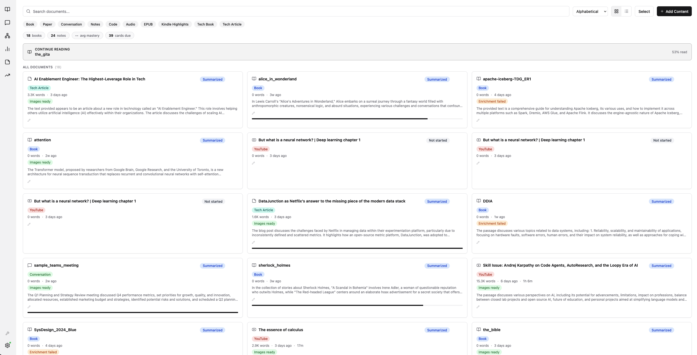
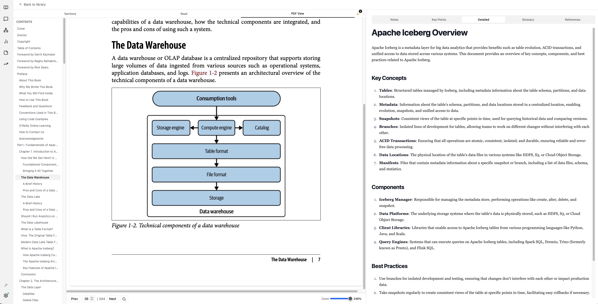
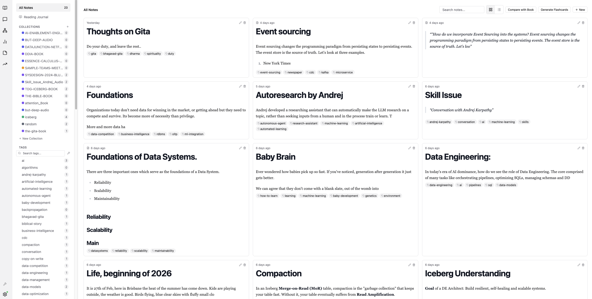

# Luminary

A local-first personal knowledge and learning assistant. Upload documents, build a knowledge graph, chat with your library, and study with AI-generated flashcards -- all running on your machine.

No data leaves your device unless you explicitly configure a cloud LLM key.

---

## Quick Start (5 minutes)

### 1. Install prerequisites

| Tool | Install |
|------|---------|
| [uv](https://docs.astral.sh/uv/) | `curl -LsSf https://astral.sh/uv/install.sh \| sh` |
| [Node 20+](https://nodejs.org/) | `brew install node` or download from nodejs.org |
| [Ollama](https://ollama.com/) | `brew install ollama` or download from ollama.com |

### 2. Pull the default LLM

```bash
# Start Ollama (if not already running)
brew services start ollama

# Pull Gemma 4 (default model)
ollama pull gemma4
```

> Requires Ollama v0.20.0+. Check with `ollama --version` and upgrade if needed.

### 3. Clone and launch

```bash
git clone <repo-url>
cd luminary

# One command does everything
make luminary
```

`make luminary` installs frontend dependencies (first run only), starts the backend (port 7820) and frontend (port 5173), and prints a ready banner when everything is up.

Open **http://localhost:5173** when you see:

```
  Luminary is ready  --  0 document(s) in library
  http://localhost:5173
```

### 4. Upload your first document

1. Go to the **Learning** tab
2. Click **Upload** and select a PDF or text file
3. Luminary parses, chunks, embeds, and indexes it automatically
4. Switch to **Chat** and ask a question about your document

---

## What you can do

### Learning -- your document library

Upload PDFs and text files. Luminary parses, chunks, embeds, and indexes them. Browse your library, view summaries, and open documents in the built-in reader.



### Reader -- read and annotate

Side-by-side PDF viewer with text search, section navigation, and Key Points summaries.



### Notes -- write and search

Markdown editor with live preview. Notes are indexed alongside your documents and appear in search results.



### Other tabs

| Tab | Purpose |
|-----|---------|
| **Chat** | Ask questions across your entire library with source citations |
| **Viz** | Explore the knowledge graph -- entities and relationships extracted from your documents |
| **Study** | Review AI-generated flashcards with spaced repetition (FSRS) |
| **Monitoring** | System health, model usage, and retrieval quality metrics |

---

## Choosing a local model

Luminary defaults to **Gemma 4** via Ollama. You can switch to any Ollama-supported model.

### Recommended models

| Model | Pull command | Best for | VRAM |
|-------|-------------|----------|------|
| **Gemma 4 E4B** | `ollama pull gemma4` | Everyday use, laptops | ~4 GB |
| **Gemma 4 26B A4B** (MoE) | `ollama pull gemma4:26b-a4b` | Balanced quality/speed | ~16 GB |
| **Gemma 4 31B** | `ollama pull gemma4:31b` | Maximum quality | ~20 GB |
| Mistral 7B | `ollama pull mistral` | Lightweight alternative | ~4 GB |
| Llama 3.1 8B | `ollama pull llama3.1` | Good general purpose | ~5 GB |

### Switching models

Create or edit `backend/.env`:

```bash
LITELLM_DEFAULT_MODEL=ollama/gemma4
```

Restart Luminary after changing the model. Verify in the **Monitoring** tab or:

```bash
curl http://localhost:7820/settings
```

### Using cloud models (optional)

Add your API key to `backend/.env`:

```bash
# OpenAI
LITELLM_DEFAULT_MODEL=openai/gpt-4o
OPENAI_API_KEY=sk-...

# Anthropic
LITELLM_DEFAULT_MODEL=anthropic/claude-sonnet-4-20250514
ANTHROPIC_API_KEY=sk-ant-...

# Google
LITELLM_DEFAULT_MODEL=gemini/gemini-2.5-flash
GOOGLE_API_KEY=...
```

---

## Configuration

All settings are environment variables in `backend/.env`. The file is gitignored.

| Variable | Default | Description |
|----------|---------|-------------|
| `LITELLM_DEFAULT_MODEL` | `ollama/gemma4` | LLM model for chat, summaries, flashcards |
| `OLLAMA_URL` | `http://localhost:11434` | Ollama server address |
| `VISION_MODEL` | `ollama/llava:13b` | Model for image/figure analysis |
| `GLINER_ENABLED` | `true` | Entity extraction (disable on low-memory machines) |
| `WEB_SEARCH_PROVIDER` | `none` | `none`, `brave`, `tavily`, or `duckduckgo` |
| `PHOENIX_ENABLED` | `true` | Arize Phoenix tracing at localhost:6006 |
| `DATA_DIR` | `.luminary` | Where Luminary stores its databases |

---

## Data Management

### Backup & Transfer
Luminary is local-first. All your data—including the library database, vector embeddings, knowledge graph, and notes—is stored in the **`.luminary`** directory at the root of the project.

To move your data to a new device:
1.  **Stop the application** to ensure database files are closed.
2.  Copy the **`.luminary/`** and **`DATA/`** (source books) directories to the same location on your new device.
3.  Copy your **`.env`** file to preserve your configuration and API keys.

### Exporting Content
If you want to use your data in other tools, you can export from the UI:
- **Markdown:** Export collections as an Obsidian-compatible Markdown vault.
- **Anki:** Export flashcard decks as `.apkg` files for study in Anki.
- **CSV:** Export individual flashcard sets for spreadsheet use.

---

## Platform Notes

### macOS Apple Silicon (recommended)

Everything works natively. Follow the Quick Start above.

### macOS Intel (x86_64)

Core packages (`lancedb`, `onnxruntime`, `kuzu`) have no Intel macOS wheels for Python 3.13. **Docker is required for the backend.**

```bash
# Install Docker Desktop, then:
make luminary
```

The script detects Intel Mac automatically and runs the backend in a container. The frontend still runs natively.

### Linux / Windows WSL

Works natively. Same Quick Start steps apply.

---

## Make Commands

### Daily use

| Command | Description |
|---------|-------------|
| `make luminary` | Start backend + frontend with readiness check (recommended) |
| `make logs` | Same as above but with DEBUG-level log output |
| `make backend` | Start backend only (port 7820) |
| `make frontend` | Start frontend only (port 5173) |

### Testing

| Command | Description |
|---------|-------------|
| `make test` | Unit + integration tests |
| `make lint` | Ruff (Python) + tsc (TypeScript) |
| `make ci` | Full CI: sync deps, lint, layer check, tests, build |
| `make smoke` | Smoke tests (requires running backend) |

### Advanced testing

| Command | Description |
|---------|-------------|
| `make test-full` | Corpus tests with real ML models (slow, downloads models on first run) |
| `make test-e2e` | End-to-end upload tests (requires running backend + Ollama) |
| `make test-perf` | Performance/latency assertions |
| `make test-books-all` | Ingest all 3 corpus books, run all book tests |
| `make eval` | RAGAS retrieval quality evaluation with threshold assertions |

---

## Architecture (for contributors)

```
Types -> Config -> Repo -> Service -> Runtime -> API
         (6-layer dependency rule -- no reverse imports)
```

| Layer | Technology |
|-------|------------|
| Backend | Python 3.13, FastAPI, LangGraph, LiteLLM |
| Storage | SQLite (metadata), LanceDB (vectors), Kuzu (graph), FTS5 (keyword search) |
| ML | BAAI/bge-m3 embeddings (1024-dim, ONNX), GLiNER (zero-shot NER) |
| Retrieval | RRF hybrid: vector + BM25 keyword + graph traversal |
| Spaced rep | FSRS algorithm |
| Frontend | React 18, TypeScript 5, Vite, shadcn/ui, Tailwind CSS |
| Graph viz | Sigma.js v3 + Graphology (WebGL, handles 10K+ nodes) |
| State | Zustand + TanStack Query |

### Backend structure

```
backend/app/
  config.py          Settings (env vars)
  models.py          SQLAlchemy ORM models
  db_init.py         DDL (tables, indexes)
  database.py        Engine + session factory
  services/          Business logic (one file per domain)
  routers/           FastAPI endpoints (one file per domain)
  runtime/           LangGraph workflows, background workers
  workflows/         Ingestion pipeline
```

### Frontend structure

```
frontend/src/
  pages/             Tab-level components (Learning, Chat, Viz, Study, Notes, Monitoring)
  components/        Reusable UI components
  store/             Zustand stores
  lib/               Utilities, API client, config
  hooks/             Custom React hooks
```

---

## Running Evaluations

Luminary includes a RAGAS-based evaluation framework with golden datasets.

```bash
# Start Langfuse (optional, requires Docker)
docker compose -f docker-compose.langfuse.yml up -d

# Run retrieval evals
cd evals && uv run python run_eval.py --dataset book --backend-url http://localhost:7820

# Run with threshold assertions (CI mode)
make eval
```

Quality thresholds:

| Metric | Threshold |
|--------|-----------|
| HR@5 | >= 0.60 |
| MRR | >= 0.45 |
| Faithfulness | >= 0.65 |

Detailed LLM traces are available in Arize Phoenix at **http://localhost:6006**.

---

## Monitoring

The **Monitoring** tab shows:

- RAG quality metrics (HR@5, MRR, Faithfulness, Context Precision)
- Ingestion queue status and progress
- Active model and provider (local vs cloud)
- Evaluation run history
- Dynamic eval runner -- select any golden dataset and trigger a RAGAS run from the UI


---

## Contributing

1. Fork the repo and create a feature branch
2. Install deps: `cd backend && uv sync` and `cd frontend && npm install`
3. Run `make ci` before opening a PR -- it must pass cleanly
4. Follow the 6-layer import rule. No reverse imports.
5. All LLM calls go through LiteLLM -- no direct provider SDK imports
6. New endpoints and service methods require at least one pytest test

---

## License

MIT
