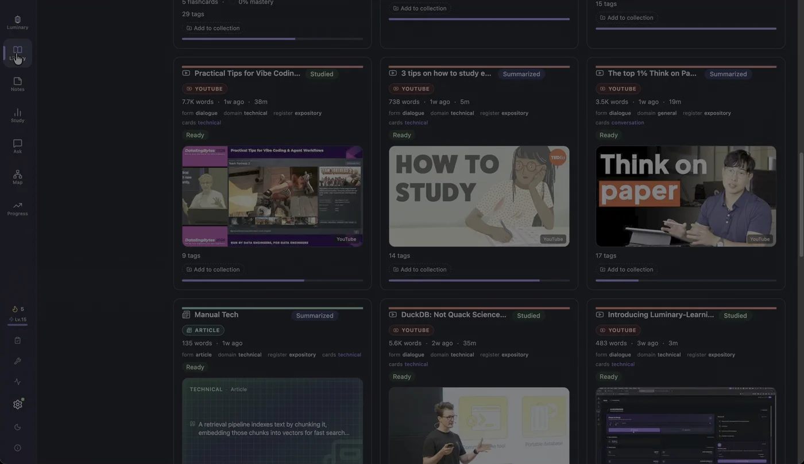

# Luminary

 **Read. Ask. Write. Master what matters.**
> A local-first study workspace built on your own documents, that measures what you actually know.

[](https://github.com/nupsea/luminary/releases/latest)
[](LICENSE)
[](#install)
[](#install)
[](#install)
[](#it-works-with-the-wifi-off)

Point it at a book, paper, video or article. Ask questions and get answers that cite the passage,
write down what you understand, turn what matters into flashcards, and let it schedule the review.
Nothing leaves your machine unless you give it an API key.

<p align="center">
  
</p>

<p align="center">
  <a href="assets/images/demo.mp4"><b>Full-quality video</b></a> · <a href="https://youtu.be/semZlbJde_Q"><b>Two-minute tour</b></a>
</p>

---

## Install

Download the installer for your system and open it. Every file is also on the
**[latest release](https://github.com/nupsea/luminary/releases/latest)**.

| System | Download | Then |
|---|---|---|
| **macOS** (Apple Silicon, macOS 14+) | [](https://github.com/nupsea/luminary/releases/download/v0.13.9/Luminary_0.13.9_aarch64.dmg) | Open it and drag Luminary to Applications |
| **Windows 10 or 11** | [](https://github.com/nupsea/luminary/releases/download/v0.13.9/Luminary_0.13.9_x64-setup.exe) | Run it; installs for your user only, no administrator prompt |
| **Linux** (Debian, Ubuntu) | [](https://github.com/nupsea/luminary/releases/download/v0.13.9/Luminary_0.13.9_amd64.deb) | Open it in your software installer, or `sudo apt install ./Luminary_*_amd64.deb` |
| **Linux** (any x86_64) | [](https://github.com/nupsea/luminary/releases/download/v0.13.9/Luminary_0.13.9_amd64.AppImage) | `chmod +x` it and run it |

The Windows installer is not yet code-signed: at *Windows protected your PC*, choose
**More info → Run anyway**.

Everything ships inside the app — Python, the local model server and every dependency — and
first launch fetches the models.

| | Download | Installed | First launch fetches |
|---|---|---|---|
| macOS | 0.6 GB | 1.4 GB | ~1.5 GB of models, then the ~3.4 GB chat model |
| Windows | 0.3 GB | 1.6 GB | the same |
| Linux | 0.6–0.7 GB | 2.1 GB | the same |

### Or install with one command

On Windows and Linux, one command picks the right installer, checks your machine before
downloading anything, verifies the download against its checksum and opens the app. On Debian
and Ubuntu it installs the `.deb` through apt (sudo once), elsewhere the AppImage in your home
folder.

**Windows** — in PowerShell:

```powershell
irm https://raw.githubusercontent.com/nupsea/luminary/master/scripts/get-luminary.ps1 | iex
```

**Linux** — in a terminal:

```bash
curl -fsSL https://raw.githubusercontent.com/nupsea/luminary/master/scripts/get-luminary.sh | bash
```

For a background service, source installs or Docker, see **[docs/install.md](docs/install.md)**.

### What your machine needs

Luminary answers with a model on your machine, so it checks the machine can run one:

| | |
|---|---|
| **Runs local models** | Apple Silicon Mac · Windows or Linux with an NVIDIA or AMD graphics card that the model actually loads onto · at least 16 GB of memory |
| **Does not** | Intel Mac · no graphics card, or only integrated graphics · under 16 GB · a card whose driver is present but which the model does not use (measured on the first answer) |

On a machine that cannot, the app says so at setup instead of offering local models, and the
one-command install says so before downloading and offers to install anyway.
Reading, search, notes, highlights and reviews all work there, and adding an API key in
Settings makes answers and flashcards work too. Summaries and tags written during ingest stay
off unless you choose Cloud mode, which sends document sections to your provider.

### Updating and uninstalling

Run the same command again, or install the new release's `.dmg`, `.exe` or `.deb`; an older
version is never installed over a newer one. Updates never touch your library.

To uninstall, use **Settings → Apps** on Windows, `sudo apt remove luminary` for the `.deb`, or
drag the app to the Trash on macOS. Or run the one-command install with `LUMINARY_UNINSTALL=1`
set (`$env:LUMINARY_UNINSTALL = "1"` in PowerShell): it lists what it will remove and asks first.
Your library — documents, notes, flashcards, settings and models — is kept and its location
printed.

---

## Why this and not a chatbot

**Every answer shows its receipts.** A citation names the section and page, and the quote is the
passage itself rather than the model's retyping of it — a model asked to retype a quote will
invent one.

**A flashcard is checked against your document.** A card's quote is verified against the text,
and a card that could not be checked says so. You know which cards are grounded and which are the
model's word.

**It measures what you remember.** Before you flip a card you say whether you know it, so you find
where you are confidently wrong. FSRS schedules the next review.

## Your first five minutes

1. **Add something.** Library → Add Content: a PDF, EPUB, docx or audio file, or a web article or
   YouTube link.
2. **Wait for the card to show Ready.** Usually under a minute.
3. **Ask it something** in the panel beside the document. Clicking a citation marks the passage it
   came from. `⌘K` / `Ctrl+K` searches everything.
4. **Make some cards.** Study → generate from the document → Start Review. Predict before you
   flip.

## It works with the wifi off

In the default Private mode everything — reading, asking, generating cards, reviewing, taking
notes, ingesting files — runs with no connection and no account, and nothing is sent anywhere.
Turn the wifi off mid-session and it keeps working.

## Faster answers, if you want them

A local model is private and slower. With an API key from
[Anthropic](https://console.anthropic.com/settings/keys),
[OpenAI](https://platform.openai.com/api-keys) or
[Google AI Studio](https://aistudio.google.com/app/apikey), answers come from a hosted model:
**Settings → LLM Mode → Answer with your API key**. Only the question and the passages retrieved
for it leave the machine — never the document, the library or your learner record.

| Measured on an M3 Pro, one document, five runs | Local (`qwen3.5:4b`) | Hosted |
|---|---|---|
| First word | ~3.1s | ~2.3s |
| Finished answer | 14–37s | 6–11s |

Search runs on your machine either way, so the key buys the finish, not the start. The installed
apps keep the key in your OS keychain. Docker and headless Linux have no keychain, so there a key
saved in Settings is written to the library database in plain text; the key panel says which
applies before you paste. **Settings → Where your work runs** lists every task and whether it runs on
this machine.

## What else is in it

| | |
|---|---|
| **Library** | Covers and thumbnails, faceted metadata, collections, tags, reading progress |
| **Read** | PDF, EPUB and web reader with sections, in-document search, highlights, saved position |
| **Ingest** | PDF, EPUB, docx, Markdown, txt, audio, video, web articles, YouTube, Kindle highlights |
| **Ask** | Hybrid retrieval (vector + keyword + graph), Socratic mode, teach-back |
| **Study** | Regular, cloze and code-trace cards; FSRS; prediction calibration |
| **Notes** | Markdown with live preview, wiki-links, backlinks, Mermaid and Excalidraw |
| **Dictate** | Speak into a note, answer or question, transcribed on your machine |
| **Figures** | Diagrams and charts from PDFs, described by a vision model so answers can use them |
| **Export** | Markdown vault (Obsidian-compatible), Anki `.apkg`, CSV |

## Your data and logs

| | Library | Log |
|---|---|---|
| macOS | `~/Library/Application Support/sh.luminary.app` | `~/Library/Logs/Luminary/luminary.log` |
| Windows | `%LOCALAPPDATA%\sh.luminary.app` | `%LOCALAPPDATA%\Luminary\Logs\luminary.log` |
| Linux | `~/.local/share/sh.luminary.app` | `~/.local/state/luminary/luminary.log` |

The library is one folder: copy it to move machines. Upgrades migrate it in place. If the app will
not start, its startup screen says why and can open a pre-filled bug report; nothing is sent until
you submit it.

---

## Contributing

Contributions are welcome — see **[CONTRIBUTING.md](CONTRIBUTING.md)**. Fork, branch from
`master`, and run `make ci` before opening a PR.

| Read | For |
|---|---|
| [DEEP_DIVE.md](DEEP_DIVE.md) | Architecture and design decisions |
| [docs/roadmap.md](docs/roadmap.md) | What is built, what is open, what was abandoned |
| [docs/architecture.md](docs/architecture.md), [docs/invariants.md](docs/invariants.md) | The rules a change must satisfy |
| [docs/install.md](docs/install.md) | Source and Docker installs, memory, models, configuration |
| [evals/README.md](evals/README.md) | The retrieval and answer evaluation harness |

Found a bug or have an idea? **[Open an issue](https://github.com/nupsea/luminary/issues/new/choose)**.

## License

Apache 2.0
