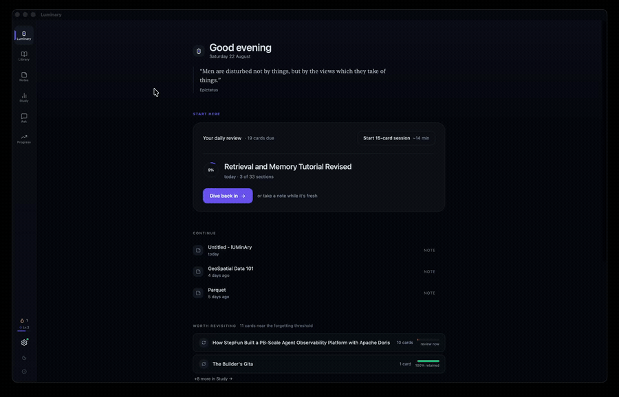

# Luminary

 **Read. Ask. Write. Master what matters.**
> A local-first study workspace built on your own documents, that measures what you actually know.

[](https://github.com/nupsea/luminary/releases/latest)
[](LICENSE)
[](#install)
[](#it-keeps-working-with-the-wifi-off)

 Point it at a book, paper, video or article. Ask it questions and get answers that cite the passage, write down what you understand, turn what matters into flashcards, and let it schedule the review. Nothing ever leaves your machine unless you hand it an API key.

<p align="center">
  
</p>

<p align="center"><a href="https://youtu.be/semZlbJde_Q"><b>Watch the two-minute tour</b></a></p>

---

## Why this and not a chatbot

Three things, and they are the whole point.

**Every answer shows its receipts.** A citation names the section and page it
came from, and the quote is lifted from that passage rather than written by the
model. It is not a nicety — a model asked to retype a quote will happily invent
one, so Luminary never lets it: the model points at a passage, and the passage
speaks for itself.

**A flashcard is checked against your document.** Cards that quote a source get
that quote verified against the text. A card that could not be checked says so
instead of quietly passing. You always know which of your deck is grounded and
which is the model's word for it.

**It measures what you actually remember.** Before you flip a card, you say
whether you know it. Luminary tracks how often you were right, so you find out
where you are confidently wrong — the thing that ordinary review hides. FSRS
schedules the next visit.

---

## Install

**macOS (Apple Silicon)** — download the `.dmg` from the
**[latest release](https://github.com/nupsea/luminary/releases/latest)**, open
it, drag Luminary to Applications. Done.

Nothing else to install: Python, every dependency and the local inference server
ship inside the app. No terminal, Homebrew, Node or separate Ollama. Needs
macOS 14 (Sonoma) or newer.

> The download is ~700 MB. First launch fetches ~1.4 GB of models; your library
> opens in about 20 seconds and the rest finishes in the background. A chat model
> is a separate ~2 GB download the app offers when you first need one.

On Linux, Windows, Intel Mac, or want it as a background service?
**[Every other install path is below.](#other-ways-to-install)**

---

## Your first five minutes

1. **Add something.** Library → Add Content. A PDF, EPUB, docx or audio file — or
   paste a web article or YouTube URL.
2. **Wait for the summary card.** Usually under a minute. That means it is
   indexed and ready.
3. **Ask it something.** The Ask tab, or `⌘K` from anywhere. Click a citation to
   land on the exact passage it came from.
4. **Make some cards.** Study → generate from the document, then Start Review.
   Predict before you flip.

That is the loop. Everything else is built on it.

---

## It keeps working with the wifi off

Luminary's default is a local model through Ollama, so the whole loop — reading,
asking, generating cards, reviewing — runs with no connection and no account.
Turn the wifi off mid-session and it keeps answering.

Prefer a frontier model? Add an OpenAI, Anthropic or Google key in Settings and
switch to Cloud or Hybrid mode. **Private mode never sends anything off the
machine**, and it will not even offer you a cloud model.

---

## What else is in it

| | |
|---|---|
| **Read** | Side-by-side PDF viewer, section navigation, dark-page mode, saved reading position, highlights and clippings |
| **Ingest** | PDF, EPUB, docx, Markdown, txt, audio, video, web articles, YouTube, Kindle highlights |
| **Ask** | Hybrid retrieval (vector + keyword + graph), Socratic mode, teach-back, optional web augmentation |
| **Study** | Regular, cloze and code-trace cards; FSRS scheduling; three-phase sessions; prediction calibration |
| **Notes** | Markdown editor with live preview, wiki-links, backlinks, Mermaid and Excalidraw |
| **Track** | Mastery rings per document, "what's about to slip", study activity, time on task |
| **Export** | Markdown vault (Obsidian-compatible), Anki `.apkg`, flashcard CSV |

The Hub is the daily entry point: it picks the one thing most worth doing now —
review what is due, carry on reading, or write something down.

---

## Other ways to install

<details>
<summary><b>macOS — one command (background service + CLI)</b></summary>

Choose this if you want Luminary running at login with a command-line tool, or
you already have a `~/.luminary` library from a source install.

The two macOS installs are independent — separate libraries, neither reads the
other's — so pick one rather than running both.

> **Beta.** Not yet tested across a wide range of Macs. If it fails, use the
> source install and please [open an issue](https://github.com/nupsea/luminary/issues).
> It registers a background service, and `luminary uninstall` cleanly reverses it.

```bash
curl -fsSL https://raw.githubusercontent.com/nupsea/luminary/master/scripts/bootstrap.sh | bash
```

Starts Luminary at login and opens it in your browser. No Homebrew, Node, git or
Xcode tools required. The app installs to
`~/Library/Application Support/Luminary`; your library stays at `~/.luminary`, so
upgrades never touch your data. Needs macOS 14+. First install pulls ~5 GB of
models and takes 15–25 minutes.

```bash
luminary status      # version, paths, service and Ollama state
luminary stop        # stop the background service
luminary update      # upgrade in place; your library is preserved
luminary uninstall   # remove the app; asks before touching your library
```
</details>

<details>
<summary><b>Linux & WSL — from source</b></summary>

A stock Ubuntu image ships none of `git`, `make` or `curl`, so install those first:

```bash
sudo apt-get update && sudo apt-get install -y git make curl
git clone https://github.com/nupsea/luminary.git
cd luminary
make install   # Installs uv, Node, Ollama; pulls models; builds the app
make start     # Production server on http://localhost:7820
```

`make install` needs `sudo` once, for Ollama and the `zstd` its installer
requires. Node is fetched into `~/.local` — apt only carries Node 18 and the
build needs 20+. Verified end to end on a clean `ubuntu:24.04` container (arm64).
</details>

<details>
<summary><b>Windows — Docker, or native</b></summary>

Docker (needs [Docker Desktop](https://www.docker.com/products/docker-desktop/)
running — check [Running under Docker](#running-under-docker) first):

```powershell
docker compose --profile ai up --build
```

Audio, video and YouTube ingestion are **off** in that image; PowerShell has no
inline `VAR=value` form, so opt in by setting it first:

```powershell
$env:WITH_MEDIA=1
docker compose --profile ai up --build
```

Native, for a proxy or VPN that blocks Docker. In a normal PowerShell window (no admin):

```powershell
Set-ExecutionPolicy Bypass -Scope Process -Force; .\scripts\install.ps1   # one-time; creates start.ps1
.\start.ps1                                                              # each time after
```

Open http://localhost:7820 when the log settles. The native install covers everything except audio and video. For those, install
ffmpeg and leave it on `PATH` (`winget install Gyan.FFmpeg`), then add **Speech
to text** from Settings — Luminary fetches that one itself.
</details>

<details>
<summary><b>macOS (Intel / x86_64) — via Docker</b></summary>

Intel Macs have no native `lancedb` wheel, so `make install` cannot run there.
Everything below is the Docker path. Apple Silicon Macs use the native path above.

**Install first**

1. [Docker Desktop](https://www.docker.com/products/docker-desktop/), running —
   check its memory and disk against
   [Running under Docker](#running-under-docker) before the first build.
   **Keep it current.** The compose targets need a stable `docker compose` (v2 or
   later, not a pre-release) and **buildx 0.17.0 or later**, both of which ship
   inside the Docker Desktop bundle. `make docker-run…` checks each and refuses
   with the fix rather than hanging. Verify with:

   ```bash
   docker compose version   # must not say alpha/beta/rc
   docker buildx version    # must be >= v0.17.0
   ```

   On a Docker Desktop too old to upgrade in place, you can override just these
   two plugins — the CLI prefers `~/.docker/cli-plugins` over the app bundle:

   ```bash
   brew install docker-compose docker-buildx
   mkdir -p ~/.docker/cli-plugins
   ln -sfn "$(brew --prefix)/opt/docker-compose/bin/docker-compose" ~/.docker/cli-plugins/docker-compose
   ln -sfn "$(brew --prefix)/opt/docker-buildx/bin/docker-buildx"   ~/.docker/cli-plugins/docker-buildx
   ```

   A 2021 Docker Desktop failed twice this way — its compose created the
   container and never started it, and its buildx was refused by a current
   compose — while its daemon was fine. Upgrading Desktop fixes both at once.
2. [Homebrew](https://brew.sh), then `brew install ollama` — only for the
   recommended path; the all-in-Docker path needs nothing but Docker.

**Recommended: inference on the host, app in Docker**

The container is already running the embedder, reranker and entity model inside
Docker's Linux VM; putting Ollama there too makes them compete for one capped
CPU allowance. On the host it gets the whole machine, and it is the only latency
change measured so far that costs nothing in answer quality.

```bash
# terminal 1 — Ollama must listen beyond loopback, or the container cannot
# reach it. It binds 127.0.0.1 by default; the container arrives via the bridge.
OLLAMA_HOST=0.0.0.0:11434 ollama serve

# terminal 2
ollama pull qwen3.5:4b
git clone https://github.com/nupsea/luminary.git
cd luminary
make docker-run-host-ollama
```

The target refuses to start rather than fail obscurely: it checks that Ollama
answers, that it is **not** bound to loopback only, and that the model is
present — the model sidecar does not run in this topology, so nothing else
will fetch it for you.

**Simplest: everything in Docker**

No Homebrew, no host Ollama. One command, and the model is pulled for you into
a Docker volume on first run. Good for trying Luminary; slow for real ingestion
— see [Running under Docker](#running-under-docker):

```bash
git clone https://github.com/nupsea/luminary.git
cd luminary
make docker-run
```

*(or directly via compose: `docker compose --profile ai up --build`)*

Either way, open http://localhost:7820. First run pulls a ~3.4 GB model and
builds the image, so give it time.

**If answering feels slow**

```bash
bash scripts/diagnose-slow-host.sh
```

One command, one paste: which build is running, whether this host measured
itself slow at start-up, which context budget that resolved to, and where a
real question's seconds went. It starts nothing and changes nothing.

Expect single-digit tokens per second either way (see
[Running under Docker](#running-under-docker)). On an Intel i7-8850H with host
Ollama, `qwen3.5:4b` decodes at ~6 tok/s, so answer length is what you feel most.

Audio, video and YouTube ingestion are **off** in this image — ffmpeg and a
transcriber are GPL, so they never travel inside anything Luminary distributes.
The image is built on your machine, so you can opt in with
`WITH_MEDIA=1 docker compose --profile ai up --build` (+850 MB). Installing
ffmpeg on the Mac itself does nothing: the backend is a Linux container and
cannot see the host's `PATH`.
</details>

> First launch is slow because it downloads ML models. Every launcher polls the
> server and prints `Luminary is ready` only when it is. Background `Warmup:` log
> lines after that are normal.
## Running it on real hardware

Everything below is reference. Skip it unless something feels slow or the app
warns you about memory — the defaults are sized for the machine you are on.

**On a Mac under Docker, expect ingestion to be slow.** No GPU passes through;
run the model outside the container instead. The Docker section has both ways.

<details>
<summary><b>How much memory it actually needs</b></summary>

Measured, not estimated — every figure below was read off a running instance.

| what is resident | GB |
|---|---|
| Ollama serving `qwen3.5:4b` | 4.2 |
| PyTorch + the embedder | 0.8 |
| Cross-encoder reranker | 0.2 |
| Entity model (GLiNER) | 1.3 |
| Peak while a document is ingesting | +1.1 |
| **total while ingesting** | **~7.6** |

**Give Luminary 12 GB to work with, and treat 8 GB as the floor where it runs
but will swap under load.** Ingestion is the peak; answering questions afterwards
sits around 6.5 GB.
</details>

### Running under Docker

> **Run the model outside the container.** Docker on a Mac is CPU-only — no GPU
> passes through — and the container is already sharing that CPU with the
> embedder, reranker and entity model. Ingesting a full technical book this way
> takes a long time and there is no setting that fixes it. Two ways out, either
> of which moves generation off the VM entirely:
>
> - **`make docker-run-host-ollama`** — Ollama on your Mac, app in Docker.
> - **A hosted model** — set `LITELLM_DEFAULT_MODEL` and its API key in `.env`
>   beside the compose file, or in Settings. See
>   [Choosing a model](#choosing-a-model).
>
> The all-in-Docker path is the simplest way to *try* Luminary, not the way to
> run a library through it.

Docker Desktop is a Linux VM. **Every number above is that VM's allowance, not
your machine's** — it gets a fraction of the host, often half, so a 16 GB Mac
presents as roughly 7.7 GB and lands under the floor. Luminary reads the VM and
says so at startup:

```
model configuration: ollama/qwen3.5:4b needs 8GB and this machine has 7GB -- it will swap under load
```

| | |
|---|---|
| **Memory** | Raise it in **Settings → Resources → Memory** |
| **Disk** | **10 GB free** before the first build, or `apt` fails partway through: a 3.4 GB image (4.2 with `WITH_MEDIA=1`) plus a 3.4 GB model blob |
| **GPU** | None passes through on any Mac, so generation runs at a few tokens per second whatever the memory |
| **Model** | Pulled into a Docker volume on first run by the `--profile ai` sidecar |
| **Secrets** | A container has no OS keyring, so a cloud API key saved in Settings is stored in the database as plain text — readable by anyone who can read the `luminary-data` volume. Put it in `.env` beside the compose file instead |

`make docker-run-host-ollama` runs the model on your machine instead of in the
VM, which takes the memory and speed rows off the table. The compose file maps
`host.docker.internal` to the host gateway, so this works on Linux as well as
Docker Desktop.

**Stopping.** `make docker-stop` leaves the containers in place for a fast
restart; `make docker-down` also removes them and the network. Neither touches
your library — no target here ever passes `--volumes`.

**A stale Docker toolchain is refused up front** rather than hanging mid-build:
compose needs buildx 0.17.0+, and compose 2.0.0-beta.4 creates a container it
never starts. Stopping still works whatever the version.

Reclaim disk with `docker builder prune -af` (build cache) and
`docker image prune -af` (unused images). **Never add `--volumes`** — that
deletes `luminary-data`, which is your library.

<details>
<summary><b>Why the first question after a break is slow, and what is already done about it</b></summary>

On a host without GPU acceleration, loading the model is the single largest
thing a question can wait on. Measured on an Intel i7-8850H in a 12 GB Docker
VM, `qwen3.5:4b` loads in anywhere from 9.6 s to 155 s; one question took 261 s
end to end and 86 s of that was the load, because Ollama had evicted the model
during the previous half-hour of idleness.

Luminary handles this without configuration: start-up times how long this
machine takes to produce one trivial answer, and where that says local
inference is expensive the backend pings the model inside the keep-alive window
so it is never evicted. A host that loads quickly
is left alone entirely — no pings, no pinned memory.

To take the eviction off the table yourself, keep the model resident for good:

```sh
OLLAMA_KEEP_ALIVE=-1 docker compose --profile ai up
```

That pins the model's memory (3.4 GB for `qwen3.5:4b`) for as long as Ollama
runs, which is worth it on a machine where a load costs a minute and wasteful
on one where it costs three seconds.

The other thing a question can wait behind is the chat's own suggested
questions, which are generated by the same model and, on the same host, took
67 s. When a question arrives while they are still being written, they are
abandoned and the ready-made suggestions are shown instead — the question gets
the machine. Where suggestions are quick they finish first and nothing is
abandoned.

**Two runtime bounds ship set.** Ollama's own defaults are not sized for a
laptop: the model stays resident for 30 minutes rather than Ollama's 5, and
llama.cpp's prompt cache is capped at 512 MB rather than its default 8192 MB —
which is more than a default Docker VM has in total. Override either with
`OLLAMA_KEEP_ALIVE` and `LLAMA_ARG_CACHE_RAM`. On a native macOS or Linux
install the Ollama server is yours, not ours, so set them there (`launchctl
setenv`, or your systemd unit) if you want them changed.
</details>

## Choosing a model

<details>
<summary><b>Which model runs, and how to change it</b></summary>

If Ollama is not running or no model is pulled, only the LLM features (chat,
teach-back, flashcards) pause — reading, search and review keep working. Fix it
with `ollama serve` and `ollama pull qwen3.5:4b` (under Docker the `--profile ai`
sidecar does it on first start).

Luminary sizes its models from your machine's RAM, and `make install` pulls what
that band needs.

| RAM | Profile | Text (chat, generation, background) | Figures | Resident |
|-----|---------|-------------------------------------|---------|----------|
| under 16 GB | `low` | `qwen3.5:4b` | the same model | 3.2 GB |
| 16–24 GB | `standard` | `qwen3.5:4b` | the same model | 3.2 GB |
| over 24 GB | `performance` | `qwen2.5:14b-instruct` | `qwen3.5:4b` | 12.9 GB |

`qwen3.5:4b` reads images as well as text, which is what lets one model fill
every role on a small machine. A second model is loaded only where both fit at
once — a 16 GB laptop can keep one model loaded, so the larger profile buys
concurrency rather than a second model.

Any Ollama-served model works; these are the ones with measured footprints and
eval numbers behind them. `ollama show <model>` lists whether a model reads images.

| Model | Command | Best for | Resident |
|-------|---------|----------|----------|
| Qwen 3.5 4B (default) | `ollama pull qwen3.5:4b` | Everyday use; also reads figures | 3.2 GB |
| Llama 3.2 3B | `ollama pull llama3.2` | The lightest option, text only | 2.9 GB |
| Phi-4 mini | `ollama pull phi4-mini` | Text only | 3.5 GB |
| Gemma 3 4B | `ollama pull gemma3:4b` | Reads figures, but least accurate on them | 3.6 GB |
| Qwen 2.5 14B | `ollama pull qwen2.5:14b-instruct` | Highest quality text, needs 24 GB+ | 9.7 GB |
| Qwen 2.5 VL 7B | `ollama pull qwen2.5vl:7b` | A dedicated figure reader | 6.8 GB |

**`backend/.env` is the one file to edit** — copy `backend/.env.example`, which
documents every model knob. Nothing else reads a model name out of
configuration, so a change there reaches every call site.

Three layers decide which model runs, strongest first:

1. **Settings in the app** — stored per-machine, wins over the file.
2. **`backend/.env`** — the deployment default for this install.
3. **The registry default** — sized from your RAM, as above.

```bash
LITELLM_DEFAULT_MODEL=ollama/gemma3:4b   # chat, and the fallback for everything
LITELLM_GENERATION_MODEL=                # empty = follow the above
VISION_MODEL=ollama/qwen2.5vl:7b         # must be a model with vision
```

Run `make models` to print what your configuration costs, which roles resolve to
which model, and any warnings.

**Cloud models.** An id is `provider/name`. A local model needs no key; a hosted
one does. You can also add the key in Settings.

A native install puts that key in your OS keychain. A container has none, so
Docker installs store it in the database as plain text — pass it as an
environment variable instead (see [Running under Docker](#running-under-docker)).

```bash
LITELLM_DEFAULT_MODEL=openai/gpt-4o
OPENAI_API_KEY=sk-...

ANTHROPIC_API_KEY=sk-ant-...
LITELLM_DEFAULT_MODEL=anthropic/claude-3-7-sonnet-latest

LITELLM_DEFAULT_MODEL=gemini/gemini-2.5-pro
GOOGLE_API_KEY=...
```

**If you pick a model too big for the machine,** Luminary warns and carries on —
at startup, at `GET /settings/models`, and in `make models`. It never overrides
your choice. The warning is real: a model that does not fit swaps under load, and
the first symptom is usually a stall during ingestion rather than an error.
</details>

<details>
<summary><b>Configuration reference</b></summary>

All settings are environment variables in `backend/.env` (gitignored).
`backend/.env.example` is the annotated template.

| Variable | Default | Description |
|----------|---------|-------------|
| `LITELLM_DEFAULT_MODEL` | `ollama/qwen3.5:4b` | Chat, and the fallback for every other role |
| `LITELLM_GENERATION_MODEL` | *(empty)* | Flashcards and summaries; empty follows the model above |
| `OLLAMA_URL` | `http://127.0.0.1:11434` | Ollama server address |
| `VISION_MODEL` | `ollama/qwen3.5:4b` | Image and figure analysis; must be a model with vision |
| `FLASHCARD_FACTUALITY_MODEL` | *(empty)* | Checks a generated card's answer against its passage; off by default |
| `LUMINARY_MEMORY_PROFILE` | *(from RAM)* | `low` / `standard` / `performance`; forces a smaller footprint |
| `PDF_VECTOR_FIGURES` | `true` | Rasterize vector-drawn PDF figures (LaTeX papers embed no images) |
| `LUMINARY_MODE` | `full` | `full` = every feature; `public` = curated learner surfaces, SPA + API on one port |
| `GLINER_ENABLED` | `true` | Entity extraction (disable on <8 GB RAM) |
| `DATA_DIR` | `.luminary` | Where databases and embeddings live |
</details>

---

## Your data

Everything — library database, vector embeddings, knowledge graph, notes — lives
in one folder. The bundled app keeps it in
`~/Library/Application Support/sh.luminary.app/`; a source install uses
`.luminary/` at the project root.

Upgrading keeps your library, flashcards and review history. The schema is
versioned with Alembic and the server migrates on startup — you never delete the
database to take a new version.

To move machines, copy `.luminary/`, `DATA/` (source files) and `backend/.env`.

To remove the app, drag it to the Trash. That leaves your library alone; delete
the folder above if you want that gone too.

<details>
<summary><b>Re-extracting figures from a document already in your library</b></summary>

Extraction improvements only apply to documents ingested after them. To re-run
figure extraction without re-uploading:

```bash
curl -X POST http://localhost:7820/documents/<document_id>/images/reextract
```

Extraction deduplicates on content hash, so this only adds figures the previous
run missed. `GET /documents/<document_id>/enrichment` shows progress.
</details>

---

## For contributors

<details>
<summary><b>Architecture, commands and the eval harness</b></summary>

```
Types -> Config -> Repo -> Service -> Runtime -> API
         (6-layer dependency rule — no reverse imports)
```

| Layer | Technology |
|-------|-----------|
| Backend | Python 3.13, FastAPI, LangGraph, LiteLLM |
| Storage | SQLite (metadata), LanceDB (vectors), Kuzu (graph), FTS5 |
| ML | BAAI/bge-small-en-v1.5 embeddings, GLiNER (zero-shot NER), ms-marco-MiniLM cross-encoder reranker |
| Retrieval | RRF hybrid (vector + BM25 + graph traversal), then cross-encoder rerank |
| Spaced rep | FSRS algorithm |
| Frontend | React, TypeScript, Vite, shadcn/ui, Tailwind CSS (versions in `frontend/package.json`) |
| Graph viz | Sigma.js v3 + Graphology |
| State | Zustand + TanStack Query |

```
backend/app/
  config.py       Settings
  models.py       SQLAlchemy ORM
  repos/          Database reads and writes
  services/       Business logic (one file per domain)
  routers/        FastAPI endpoints
  runtime/        LangGraph workflows, background workers
  workflows/      Ingestion pipeline

frontend/src/
  pages/          Tab-level components
  components/     Reusable UI
  store/          Zustand stores
  lib/            Utilities, API client
  hooks/          Custom React hooks
```

| Command | What it does |
|---------|-------------|
| `make install` | One-time setup (uv, Node, Ollama, models, build) |
| `make start` | Public-mode server on :7820 |
| `make luminary` | Backend + frontend in full mode (:7820 + :5173) |
| `make stop` | Stop Luminary on :7820, gracefully (also stops the container when it serves the port) |
| `make test` | Backend unit + integration tests |
| `make lint` | Ruff + tsc + eslint + manifest checks |
| `make ci` | **The gate.** Lint, layer check, tests, build, tsc, eslint, vitest |
| `make smoke` | ~180 HTTP contract scripts against a running backend |
| `make db-migrate` | Apply pending migrations (the server also does this on boot) |
| `make db-revision m="..."` | Generate a migration after changing `models.py` |
| `make docker-run` | Run via Docker Compose (with Ollama sidecar) |
| `make docker-stop` | Stop the compose stack, containers kept for a fast restart |
| `make docker-down` | Stop and remove containers and network; **volumes, i.e. your library, are kept** |

**Evaluation harness.** Retrieval is scored with HR@5 / MRR / nDCG@10;
faithfulness uses a dedicated NLI model (Vectara HHEM-2.1-Open) rather than an
LLM judge, so it is deterministic and needs no API key. See
[`evals/README.md`](evals/README.md).

```bash
cd evals && uv run python run_eval.py --dataset book --backend-url http://localhost:7820
```

Asserted thresholds: HR@5 ≥ 0.50, MRR ≥ 0.35, and — whenever a run generated
answers — faithfulness ≥ 0.30, answer rate ≥ 0.75 and citation coverage ≥ 0.60.
The `notes` dataset holds a higher bar (HR@5 ≥ 0.60, MRR ≥ 0.45); `paper` holds
0.80 / 0.60. nDCG@10 is computed and reported but **never asserted** — most
goldens carry single-passage relevance, where nDCG degrades to a log-discounted
single-hit metric. These are **collapse detectors, not quality bars** — clearing
them says a leg of the funnel is alive, not that a change was an improvement. A
metric that was requested and could not be computed fails the run rather than
being skipped.

**Platform support.**

| Platform | Status |
|---------|--------|
| macOS Apple Silicon | Native, fully supported |
| macOS Intel | Docker required for backend |
| Linux / WSL | Native, same steps |
| Windows | Docker, or natively via `scripts/install.ps1` |

**Documentation.**

- **[DEEP_DIVE.md](DEEP_DIVE.md)** — architecture, design decisions, and the
  engineering philosophy.
- **[docs/roadmap.md](docs/roadmap.md)** — what is built, what is open, what was
  deliberately abandoned. Check it before proposing work.
- **[docs/architecture.md](docs/architecture.md)** and
  **[docs/invariants.md](docs/invariants.md)** — the rules a change has to satisfy.

Every other file in `docs/` describes something that already exists;
`roadmap.md` is the only one carrying status.
</details>

**Contributions are welcome.** See **[CONTRIBUTING.md](CONTRIBUTING.md)**. In
short: fork, branch from `master`, run `make ci` before opening a PR, follow the
6-layer import rule, route all LLM calls through LiteLLM, and give new endpoints
a pytest test.

Found a bug or have an idea?
**[Open an issue](https://github.com/nupsea/luminary/issues/new/choose)** — or
browse [open issues](https://github.com/nupsea/luminary/issues) to pick something up.

**If the app will not start,** the startup screen says what went wrong and can
open a pre-filled bug report — nothing is sent until you have read and submitted
it yourself. There is also a log at `~/Library/Logs/Luminary/luminary.log`.

---

## License

Apache 2.0
