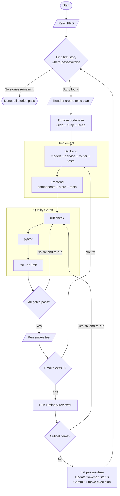

# Ralph Run Flow

This document describes the step-by-step cycle ralph follows when executing stories from a PRD.

Ralph is invoked as an AI agent (Claude) that reads a PRD file, finds the next unimplemented story,
implements it end-to-end, and loops until all stories pass. The flow below is the contract each run
must follow. Do not skip steps.

---

## Flowchart

---

## Artifact Map

Each story SXXX produces or modifies these artifacts:

| Artifact | Location | When |
|---|---|---|
| Execution plan | `docs/exec-plans/active/SXXX.md` | Created before implementation starts |
| Backend changes | `backend/app/{models,services,routers}/` | During implement |
| DB migration | `backend/app/db_init.py` | During implement (if schema changes) |
| Backend tests | `backend/tests/test_*.py` | During implement |
| Frontend components | `frontend/src/components/` | During implement |
| Frontend pages | `frontend/src/pages/` | During implement (if page-level) |
| Smoke test | `scripts/smoke/SXXX.sh` | During implement |
| PRD update | `scripts/ralph/prd-vN.json` | After all gates pass (`passes: true`) |
| Progress log | `scripts/ralph/progress.txt` | After all gates pass |
| Completed plan | `docs/exec-plans/completed/SXXX.md` | After PRD update |

---

## Quality Gate Rules

1. **ruff**: zero warnings, zero errors. Fix linting before running tests -- failing lint masks test errors.
2. **pytest**: test count must not decrease from the regression baseline. Any drop is a regression -- stop and fix.
3. **tsc**: zero type errors. `any` is acceptable only when the upstream type is genuinely unknown; never cast to silence an error.
4. **smoke**: smoke tests verify the backend contract the UI depends on. A smoke test that only curls the new endpoint is insufficient when the story spans multiple API calls. See `docs/design-docs/story-authoring.md`.
5. **reviewer**: `luminary-reviewer` uses Sonnet. Critical items must be resolved. Warning items should be noted in progress.txt but do not block `passes: true`.

---

## Retry Rules

- Gate failure (ruff/pytest/tsc): fix then restart gates from ruff. Do not skip earlier gates.
- Smoke failure: fix backend logic, then re-run gates + smoke.
- Reviewer critical: fix then re-run gates + smoke + reviewer.
- Never set `passes: true` before smoke exits 0 and reviewer returns no Critical items.

---

## Version History

| Version | PRD | Branch | Stories |
|---|---|---|---|
| v2 | `scripts/ralph/prd-v2.json` | `ralph/luminary-v2` | S75-S160 (all pass) |
| v3 Phase 1 | `scripts/ralph/prd-v3.json` | `ralph/luminary-v3` | S161-S170 (all pass) -- Note organization: collections, hierarchical tags, graph nodes, performance |
| v3 Phase 2 | `scripts/ralph/prd-v3.json` | `ralph/luminary-v3` | S171-S175 (all pass) -- Note intelligence: bidirectional links, Viz integration, health reports, Obsidian/Anki export, multi-doc notes |
| v3 Phase 3 | `scripts/ralph/prd-v3.json` | `ralph/luminary-v3` | S176-S183 (all pass) -- UX polish and learner focus |
| v3 Phase 4 | `scripts/ralph/prd-v3.json` | `ralph/luminary-v3` | S184-S190 (pending) -- Learner experience refinement |

## V3 Phase 3 Story Status

| Story | Title | Status |
|---|---|---|
| S176 | Notes reader-first layout: wider content, floating actions, clickable tags | pass |
| S177 | Progress tab: Monitoring renamed, dev metrics at /admin, GoalsPanel moved | pass |
| S178 | Study tab: Smart Generate, merged health panels, fix 'default' deck label | pass |
| S179 | Context-aware flashcard generation: chunk classification, genre-aware prompts | pass |
| S180 | Chat simplification: settings drawer, collapsed transparency panel | pass |
| S181 | Viz overhaul: View Options panel, Select All entity types, hide Call Graph | pass |
| S182 | YouTube transcript viewer: full Read section parity | pass |
| S183 | Learning tab: slim stats bar, document list as primary focus | pass |

## V3 Phase 4 Story Status

| Story | Title | Status |
|---|---|---|
| S184 | Flashcard search and unified browse replaces deck-first navigation | pass |
| S185 | Simplified Study tab: single generate button with adaptive defaults | pass |
| S186 | Chat: inline document scope selector replaces settings drawer scope | pass |
| S187 | Chat: document-aware contextual recommendations | pass |
| S188 | Flashcard generation: context-rich questions with source grounding | pass |
| S189 | Auto-organize: guided plan with confirmation workflow | pass |
| S190 | Tag search: type-ahead search in Notes sidebar | pass |
